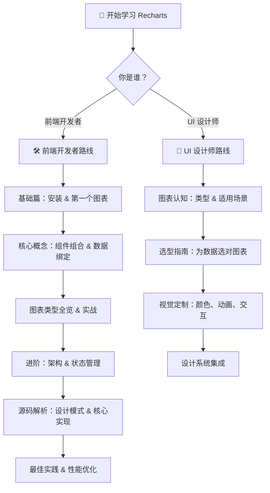

# 📊 Recharts 学习指南 | Learning Guide

> **Recharts** — 用 React 组件构建图表的声明式可视化库（Declarative Charting Library for React）

---

## 🌟 项目简介（What & Why）

**Recharts** 是一个基于 **React** 和 **D3** 的声明式图表库，让前端开发者能够像搭积木一样用 React 组件组合出漂亮的数据可视化图表。

### 为什么选择 Recharts？

| 特性 | 说明 |
|------|------|
| 🧩 **声明式 API** | 像写 HTML 一样写图表，无需命令式操作 |
| ⚛️ **原生 React** | 每个图表元素都是 React 组件，完全融入 React 生态 |
| 📐 **SVG 渲染** | 轻量、清晰、天然支持响应式 |
| 🎨 **高度可定制** | 从颜色到形状，一切皆可自定义 |
| 🔧 **组合式设计** | XAxis、Tooltip、Legend 都是独立组件，自由组合 |
| 📦 **TypeScript 支持** | 完整的类型定义，开发体验一流 |

### 一个最简单的例子

```jsx
import { LineChart, Line, XAxis, YAxis, Tooltip } from 'recharts';

const data = [
  { name: '一月', sales: 400 },
  { name: '二月', sales: 300 },
  { name: '三月', sales: 600 },
  { name: '四月', sales: 800 },
];

function MyChart() {
  return (
    <LineChart width={600} height={300} data={data}>
      <XAxis dataKey="name" />
      <YAxis />
      <Tooltip />
      <Line type="monotone" dataKey="sales" stroke="#8884d8" />
    </LineChart>
  );
}
```

这段代码就像在说："给我一个折线图，X 轴显示名称，Y 轴自动算，有提示框，画一条紫色的 sales 折线。"

---

## 🗺️ 学习路径地图（Learning Roadmap）



---

## 📚 前端开发者学习路线（Front-end Developer Path）

面向有 React 基础的前端开发者，从使用到源码全面掌握 Recharts。

| 序号 | 章节 | 内容 | 难度 |
|------|------|------|------|
| 01 | [🚀 快速开始](./front-end/01-getting-started.md) | 安装、环境配置、第一个图表 | ⭐ |
| 02 | [🧩 核心概念](./front-end/02-core-concepts.md) | 组件组合、DataKey、坐标系、Scale | ⭐⭐ |
| 03 | [📊 图表类型与实战](./front-end/03-bindingdata-bindingcharts.md) | 所有图表类型详解 + 代码示例 | ⭐⭐ |
| 04 | [⚙️ 进阶：架构与状态管理](./front-end/04-bindingdata-charts-architecture.md) | Redux 架构、数据流、事件系统 | ⭐⭐⭐ |
| 05 | [🔍 源码解析](./front-end/05-source-code-deep-dive.md) | 核心代码分析、设计模式 | ⭐⭐⭐⭐ |
| 06 | [✅ 最佳实践](./front-end/06-best-practices.md) | 性能优化、常见问题、实战模式 | ⭐⭐⭐ |

---

## 🎨 UI 设计师学习路线（UI Designer Path）

面向 UI/UX 设计师，聚焦图表选型、视觉设计和交互体验。

| 序号 | 章节 | 内容 | 难度 |
|------|------|------|------|
| 01 | [📊 图表世界概览](./ui-designer/01-bindingdata-charts-overview.md) | 数据可视化基础、图表分类 | ⭐ |
| 02 | [🎯 图表选型指南](./ui-designer/02-chart-selection-guide.md) | 如何为数据选择合适的图表 | ⭐⭐ |
| 03 | [🎨 视觉定制与交互设计](./ui-designer/03-bindingdata-charts-customization.md) | 颜色、动画、提示框、图例 | ⭐⭐ |

---

## 🔗 通用学习资源（Further Learning）

| 章节 | 内容 |
|------|------|
| [📖 扩展学习](./further-learning.md) | 相关知识点、延伸阅读、社区资源 |

---

## 🎯 适合人群

### 前端开发者（Front-end Developer）

- ✅ 有 React 基础（了解组件、Props、Hooks）
- ✅ 需要在项目中添加数据可视化
- ✅ 想深入了解 Recharts 的架构和源码
- ✅ 想学习优秀的 React 库设计思想

### UI 设计师（UI Designer）

- ✅ 需要理解数据可视化的基本原则
- ✅ 想了解 Recharts 支持哪些图表类型
- ✅ 需要与开发团队协作设计图表
- ✅ 想了解 Recharts 的视觉定制能力

---

## 📋 推荐学习顺序

### 如果你赶时间（30 分钟速成）：
1. 本页面（了解 Recharts 是什么）
2. [快速开始](./front-end/01-getting-started.md)（跑起来）
3. [最佳实践](./front-end/06-best-practices.md)（避坑）

### 如果你想系统学习（3-5 小时）：
1. 按前端开发者路线从 01 到 06 依次阅读
2. 每章的代码示例都动手试一试

### 如果你是设计师：
1. 按 UI 设计师路线从 01 到 03 依次阅读
2. 重点关注图表选型和视觉定制

---

> 💡 **提示**：所有教程中的代码示例都基于 Recharts v3.x，如果你使用的是 v2.x，部分 API 可能有差异。

> 📝 **贡献**：发现错误或有改进建议？欢迎提交 Issue 或 PR！
