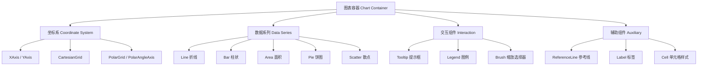

# 🚀 快速开始（Getting Started）

> 本章目标：安装 Recharts、理解基本用法、渲染你的第一个图表

---

## 📦 安装（Installation）

### 使用 npm

```bash
npm install recharts
```

### 使用 yarn

```bash
yarn add recharts
```

### 使用 pnpm

```bash
pnpm add recharts
```

### 前置条件（Prerequisites）

Recharts 是 React 的图表库，你需要确保项目中已经安装了 React：

```json
{
  "peerDependencies": {
    "react": "^16.8.0 || ^17.0.0 || ^18.0.0 || ^19.0.0",
    "react-dom": "^16.0.0 || ^17.0.0 || ^18.0.0 || ^19.0.0"
  }
}
```

> 💡 Recharts 支持从 React 16.8（Hooks 发布版本）到 React 19 的所有版本。

---

## 🎯 第一个图表：折线图（Your First Chart）

### 第一步：准备数据

Recharts 的数据就是一个普通的 JavaScript 数组，每个元素是一个对象：

```typescript
const data = [
  { month: '1月', revenue: 4000, cost: 2400 },
  { month: '2月', revenue: 3000, cost: 1398 },
  { month: '3月', revenue: 2000, cost: 9800 },
  { month: '4月', revenue: 2780, cost: 3908 },
  { month: '5月', revenue: 1890, cost: 4800 },
  { month: '6月', revenue: 2390, cost: 3800 },
];
```

### 第二步：导入组件

```typescript
import {
  LineChart,    // 折线图容器
  Line,         // 折线
  XAxis,        // X 轴
  YAxis,        // Y 轴
  CartesianGrid,// 网格线
  Tooltip,      // 鼠标悬浮提示
  Legend,        // 图例
} from 'recharts';
```

### 第三步：组合成图表

```tsx
function RevenueChart() {
  return (
    <LineChart width={730} height={300} data={data}>
      <CartesianGrid strokeDasharray="3 3" />
      <XAxis dataKey="month" />
      <YAxis />
      <Tooltip />
      <Legend />
      <Line type="monotone" dataKey="revenue" stroke="#8884d8" name="收入" />
      <Line type="monotone" dataKey="cost" stroke="#82ca9d" name="成本" />
    </LineChart>
  );
}
```

### 理解这段代码

让我们逐行解读：

| 代码 | 作用 |
|------|------|
| `<LineChart width={730} height={300} data={data}>` | 创建折线图容器，设定宽高，传入数据 |
| `<CartesianGrid strokeDasharray="3 3" />` | 添加虚线背景网格 |
| `<XAxis dataKey="month" />` | X 轴显示每个数据点的 `month` 字段 |
| `<YAxis />` | Y 轴自动根据数据范围计算刻度 |
| `<Tooltip />` | 鼠标悬浮时显示数据详情 |
| `<Legend />` | 在图表下方显示图例 |
| `<Line dataKey="revenue" ... />` | 画一条折线，取每个数据点的 `revenue` 值 |
| `<Line dataKey="cost" ... />` | 画第二条折线，取 `cost` 值 |

> 🎯 **核心思想**：Recharts 就像拼乐高——每个组件负责一件事，你把它们组合在一起就成了一个完整的图表。

---

## 📐 理解 Recharts 的"积木"体系

Recharts 的组件可以分为几大类：



### 五大组件类别

| 类别 | 组件示例 | 职责 |
|------|---------|------|
| **容器（Container）** | `LineChart`, `BarChart`, `PieChart` | 定义图表类型和整体布局 |
| **坐标系（Coordinate）** | `XAxis`, `YAxis`, `CartesianGrid` | 定义坐标轴和网格 |
| **数据系列（Series）** | `Line`, `Bar`, `Area`, `Pie` | 渲染实际数据 |
| **交互（Interaction）** | `Tooltip`, `Legend`, `Brush` | 提供用户交互能力 |
| **辅助（Auxiliary）** | `ReferenceLine`, `Label`, `Cell` | 添加标注、标签等辅助信息 |

---

## 🔄 响应式图表（Responsive Charts）

在实际项目中，我们通常不想硬编码图表宽度。使用 `ResponsiveContainer` 让图表自动适应容器大小：

```tsx
import { ResponsiveContainer, LineChart, Line, XAxis, YAxis } from 'recharts';

function ResponsiveChart() {
  return (
    <ResponsiveContainer width="100%" height={300}>
      <LineChart data={data}>
        <XAxis dataKey="month" />
        <YAxis />
        <Line type="monotone" dataKey="revenue" stroke="#8884d8" />
      </LineChart>
    </ResponsiveContainer>
  );
}
```

> ⚠️ **注意**：`ResponsiveContainer` 的父元素必须有明确的宽度和高度，否则它无法正确计算尺寸。

---

## 🎨 常见图表类型速览

### 柱状图（Bar Chart）

```tsx
import { BarChart, Bar, XAxis, YAxis, Tooltip } from 'recharts';

<BarChart width={600} height={300} data={data}>
  <XAxis dataKey="month" />
  <YAxis />
  <Tooltip />
  <Bar dataKey="revenue" fill="#8884d8" />
  <Bar dataKey="cost" fill="#82ca9d" />
</BarChart>
```

### 面积图（Area Chart）

```tsx
import { AreaChart, Area, XAxis, YAxis, Tooltip } from 'recharts';

<AreaChart width={600} height={300} data={data}>
  <XAxis dataKey="month" />
  <YAxis />
  <Tooltip />
  <Area type="monotone" dataKey="revenue" fill="#8884d8" stroke="#8884d8" />
</AreaChart>
```

### 饼图（Pie Chart）

```tsx
import { PieChart, Pie, Tooltip, Cell } from 'recharts';

const colors = ['#0088FE', '#00C49F', '#FFBB28', '#FF8042'];

<PieChart width={400} height={400}>
  <Pie data={data} dataKey="revenue" nameKey="month" cx="50%" cy="50%" outerRadius={120}>
    {data.map((entry, index) => (
      <Cell key={index} fill={colors[index % colors.length]} />
    ))}
  </Pie>
  <Tooltip />
</PieChart>
```

---

## 🧪 动手练习（Try It Yourself）

### 练习 1：修改图表样式

在折线图的基础上，尝试：

1. 把 `type="monotone"` 改成 `type="linear"`，观察线条差异
2. 给 `Line` 添加 `strokeWidth={3}`
3. 给 `Line` 添加 `dot={{ r: 6 }}` 放大数据点

### 练习 2：混合图表

尝试创建一个同时包含折线和柱状的混合图表：

```tsx
import { ComposedChart, Line, Bar, XAxis, YAxis, Tooltip, Legend } from 'recharts';

<ComposedChart width={600} height={300} data={data}>
  <XAxis dataKey="month" />
  <YAxis />
  <Tooltip />
  <Legend />
  <Bar dataKey="revenue" fill="#8884d8" />
  <Line type="monotone" dataKey="cost" stroke="#ff7300" />
</ComposedChart>
```

### 练习 3：添加参考线

```tsx
import { ReferenceLine } from 'recharts';

// 在 LineChart 内添加：
<ReferenceLine y={3000} stroke="red" label="目标" strokeDasharray="5 5" />
```

---

## 📋 本章小结

| 你学到了 | 关键点 |
|----------|--------|
| 安装方式 | `npm install recharts`，需要 React 16.8+ |
| 核心思想 | 组件组合——每个图表元素都是独立的 React 组件 |
| 数据格式 | 普通 JS 数组，每个元素是一个对象 |
| 基本用法 | 容器 + 坐标系 + 数据系列 + 交互组件 |
| 响应式 | 使用 `ResponsiveContainer` 包裹 |

---

## ➡️ 下一章

[🧩 核心概念 — 深入理解组件组合与数据绑定](./02-core-concepts.md)
