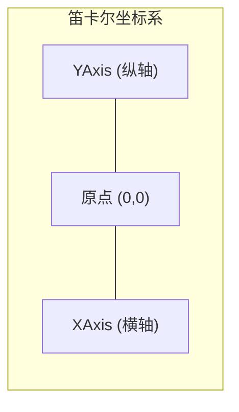
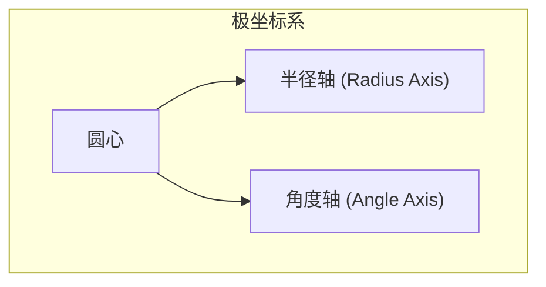
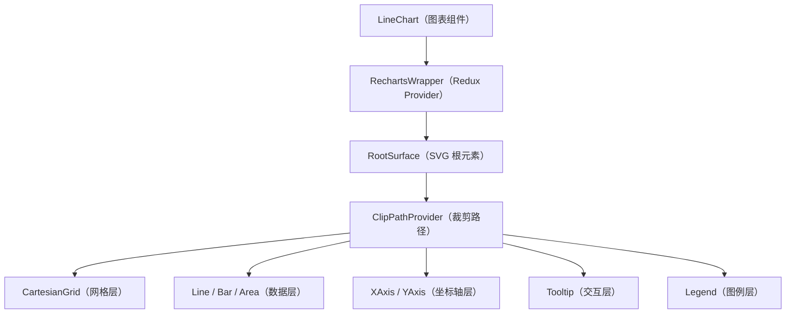
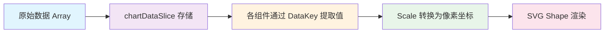

# 🧩 核心概念（Core Concepts）

> 本章目标：深入理解 Recharts 的组件组合模型、DataKey 数据绑定、坐标系统和 Scale 机制

---

## 🎯 组件组合模型（Component Composition）

### 为什么是"组合"而不是"配置"？

许多图表库（如 ECharts、Chart.js）采用**配置对象**的方式——你传入一个巨大的 JSON 配置：

```javascript
// ❌ 配置式 API（其他库的做法）
const chart = new Chart({
  type: 'line',
  xAxis: { data: ['Mon', 'Tue', 'Wed'] },
  yAxis: {},
  series: [{ data: [120, 200, 150], type: 'line' }],
  tooltip: { trigger: 'axis' },
  legend: { show: true },
});
```

Recharts 选择了**组件组合**——每个图表元素都是独立的 React 组件：

```tsx
// ✅ Recharts 的组合式 API
<LineChart data={data}>
  <XAxis dataKey="name" />
  <YAxis />
  <Tooltip />
  <Legend />
  <Line dataKey="value" />
</LineChart>
```

### 为什么这样设计？

| 组合式的优势 | 说明 |
|-------------|------|
| **React 原生** | 与 React 的心智模型完全一致，不需要学习新范式 |
| **灵活控制** | 不需要的组件直接不写，不像配置式需要设置 `show: false` |
| **条件渲染** | 可以用 JSX 条件逻辑动态显隐组件 |
| **自定义渲染** | 每个组件都支持自定义渲染函数 |
| **类型安全** | TypeScript 可以为每个组件独立定义 Props 类型 |

### 类比理解

把 Recharts 想象成**搭乐高**：

```
📦 LineChart（底板）
  ├── 📐 XAxis（X 轴导轨）
  ├── 📐 YAxis（Y 轴导轨）
  ├── 🔲 CartesianGrid（网格背景板）
  ├── 📈 Line（数据折线积木）
  ├── 📈 Line（第二条折线积木）
  ├── 💬 Tooltip（提示卡片）
  └── 📋 Legend（图例标签）
```

每块积木可以独立存在，也可以自由组合。你不需要的积木就不放上去。

---

## 🔑 DataKey — 数据绑定的核心

### 什么是 DataKey？

`dataKey` 是 Recharts 中最重要的 Props 之一。它告诉组件"从数据中取哪个字段"。

```typescript
const data = [
  { name: '产品A', sales: 400, profit: 240 },
  { name: '产品B', sales: 300, profit: 139 },
];

// dataKey="sales" 意味着从每个数据点取 sales 字段的值
<Line dataKey="sales" />
// 等价于：data.map(item => item.sales)  → [400, 300]
```

### DataKey 的三种形式

```typescript
// 1️⃣ 字符串形式（最常用）——直接指定字段名
<Line dataKey="sales" />

// 2️⃣ 函数形式——灵活计算
<Line dataKey={(entry) => entry.sales * 1.1} />

// 3️⃣ 嵌套路径——访问嵌套对象
const data = [{ info: { sales: 400 } }];
<Line dataKey="info.sales" />
```

### XAxis 和 YAxis 的 DataKey

需要特别理解的是：

- **XAxis 的 `dataKey`**：决定 X 轴上显示什么标签
- **Line/Bar 的 `dataKey`**：决定数据点在 Y 轴方向上的值
- **YAxis** 通常不需要 `dataKey`，它会自动根据数据范围计算

```tsx
const data = [
  { month: '一月', temperature: 20, humidity: 65 },
  { month: '二月', temperature: 25, humidity: 70 },
];

<LineChart data={data}>
  <XAxis dataKey="month" />        {/* X 轴标签："一月"，"二月" */}
  <YAxis />                        {/* Y 轴范围自动计算 */}
  <Line dataKey="temperature" />   {/* 折线数据：20, 25 */}
  <Line dataKey="humidity" />      {/* 折线数据：65, 70 */}
</LineChart>
```

### DataKey 的类型定义

```typescript
// Recharts 中 DataKey 的类型
type DataKey<T> = string | number | ((obj: T) => any);
```

这个灵活的设计让你可以处理各种数据结构。

---

## 📐 坐标系统（Coordinate Systems）

Recharts 支持两大坐标系统：

### 1. 笛卡尔坐标系（Cartesian Coordinate System）

用于折线图、柱状图、面积图、散点图等：



特点：
- 两条互相垂直的轴（X 和 Y）
- 数据点用 (x, y) 坐标定位
- 支持水平（horizontal）和垂直（vertical）两种布局

```tsx
// 水平布局（默认）：X 轴在底部，Y 轴在左侧
<LineChart data={data} layout="horizontal">

// 垂直布局：X 轴在左侧，Y 轴在底部
<BarChart data={data} layout="vertical">
```

### 2. 极坐标系（Polar Coordinate System）

用于饼图、雷达图、径向柱状图等：



特点：
- 数据用角度和半径定位
- 适合展示比例关系和多维对比

```tsx
// 雷达图使用极坐标
<RadarChart data={data}>
  <PolarGrid />
  <PolarAngleAxis dataKey="subject" />
  <PolarRadiusAxis />
  <Radar dataKey="score" />
</RadarChart>
```

---

## ⚖️ Scale — 数据到像素的映射

### 什么是 Scale？

Scale（比例尺）解决一个核心问题：**如何把数据值转换成屏幕上的像素坐标**。

```
数据空间                 像素空间
[0, 1000]   ──Scale──>  [0, 600]px
```

### 类比理解

想象一张地图：

- **数据域（Domain）** = 真实世界的经纬度范围，比如 [0, 1000]
- **像素范围（Range）** = 地图纸张的大小，比如 [0, 600] 像素
- **Scale** = 地图的"比例尺"，告诉你 1 单位数据对应多少像素

### Scale 的类型

| Scale 类型 | 适用场景 | 例子 |
|-----------|----------|------|
| **linear**（线性） | 连续数值 | 温度、价格 |
| **band**（带状） | 分类数据 | 月份名、产品名 |
| **log**（对数） | 数据范围差异大 | 人口数据 |
| **time**（时间） | 时间序列 | 日期数据 |
| **ordinal**（序数） | 离散有序数据 | 等级 |

```tsx
// 线性比例尺（数值轴，默认）
<YAxis type="number" scale="linear" />

// 带状比例尺（分类轴，XAxis 默认）
<XAxis dataKey="name" type="category" />

// 对数比例尺
<YAxis type="number" scale="log" domain={[1, 10000]} />

// 时间比例尺
<XAxis dataKey="date" scale="time" type="number"
       domain={['dataMin', 'dataMax']}
       tickFormatter={(timestamp) => new Date(timestamp).toLocaleDateString()} />
```

### Domain（定义域）— 数据的范围

```tsx
// 自动计算（默认）
<YAxis />

// 手动指定范围
<YAxis domain={[0, 100]} />

// 使用特殊值
<YAxis domain={['dataMin', 'dataMax']} />      // 自动匹配数据最小/最大值
<YAxis domain={['auto', 'auto']} />            // 自动计算"好看"的范围
<YAxis domain={[0, 'dataMax + 100']} />        // 基于数据的计算
<YAxis domain={[(dataMin) => dataMin * 0.9, (dataMax) => dataMax * 1.1]} />  // 函数计算
```

---

## 🏗️ 图表容器的层次结构

每个 Recharts 图表内部有一个清晰的层次结构：



理解这个层次很重要：

1. **图表组件**（如 `LineChart`）仅是一个配置入口
2. **RechartsWrapper** 创建独立的 Redux Store 管理图表状态
3. **RootSurface** 是实际的 `<svg>` 元素
4. 子组件通过 **Redux** 注册自己并获取数据

---

## 📊 数据处理流程

从原始数据到图表渲染的完整流程：



### 详细步骤

```
1. 你传入 data 数组
   data = [{ name: 'A', value: 100 }, { name: 'B', value: 200 }]

2. Chart 组件将数据存入 Redux Store
   dispatch(setChartData(data))

3. XAxis 组件用 dataKey="name" 提取类别标签
   ['A', 'B'] → 创建 band scale → 计算每个标签的 X 位置

4. Line 组件用 dataKey="value" 提取数值
   [100, 200] → 通过 YAxis 的 linear scale → 转换为 Y 像素坐标

5. 最终得到像素坐标点
   [{x: 100, y: 250}, {x: 500, y: 50}]

6. 用 SVG <path> 连接这些点，画出折线
```

---

## 🎭 自定义渲染（Custom Rendering）

Recharts 的几乎每个可视元素都支持自定义渲染，这是其灵活性的核心：

### 自定义 Tooltip

```tsx
const CustomTooltip = ({ active, payload, label }) => {
  if (!active || !payload?.length) return null;

  return (
    <div style={{ background: 'white', padding: '10px', border: '1px solid #ccc' }}>
      <p style={{ fontWeight: 'bold' }}>{label}</p>
      {payload.map((entry, index) => (
        <p key={index} style={{ color: entry.color }}>
          {entry.name}: {entry.value}
        </p>
      ))}
    </div>
  );
};

<Tooltip content={<CustomTooltip />} />
```

### 自定义数据点

```tsx
const CustomDot = (props) => {
  const { cx, cy, value } = props;
  return value > 500
    ? <circle cx={cx} cy={cy} r={8} fill="red" />    // 高值用红色大点
    : <circle cx={cx} cy={cy} r={4} fill="blue" />;   // 低值用蓝色小点
};

<Line dataKey="value" dot={<CustomDot />} />
```

### 自定义坐标轴刻度

```tsx
const CustomTick = ({ x, y, payload }) => (
  <g transform={`translate(${x},${y})`}>
    <text x={0} y={0} dy={16} textAnchor="middle" fill="#666">
      {payload.value}
    </text>
  </g>
);

<XAxis dataKey="name" tick={<CustomTick />} />
```

---

## 🔤 重要 Props 速查

### 图表容器通用 Props

| Prop | 类型 | 说明 |
|------|------|------|
| `width` | `number` | 图表宽度（像素） |
| `height` | `number` | 图表高度（像素） |
| `data` | `Array<object>` | 数据数组 |
| `margin` | `{ top, right, bottom, left }` | 图表内边距 |
| `layout` | `'horizontal' \| 'vertical'` | 布局方向 |
| `onClick` | `function` | 点击事件回调 |
| `onMouseMove` | `function` | 鼠标移动事件回调 |

### Line / Bar / Area 通用 Props

| Prop | 类型 | 说明 |
|------|------|------|
| `dataKey` | `string \| function` | 数据字段绑定 |
| `name` | `string` | 图例和 Tooltip 显示名称 |
| `stroke` / `fill` | `string` | 颜色 |
| `hide` | `boolean` | 是否隐藏 |
| `isAnimationActive` | `boolean` | 是否启用动画 |
| `animationDuration` | `number` | 动画持续时间（ms） |

### XAxis / YAxis Props

| Prop | 类型 | 说明 |
|------|------|------|
| `dataKey` | `string` | 绑定数据字段 |
| `type` | `'number' \| 'category'` | 轴数据类型 |
| `domain` | `[min, max]` | 轴范围 |
| `scale` | `'linear' \| 'log' \| 'band' \| ...` | 比例尺类型 |
| `tickFormatter` | `function` | 刻度文本格式化 |
| `hide` | `boolean` | 是否隐藏坐标轴 |

---

## 📋 本章小结

| 核心概念 | 关键理解 |
|----------|----------|
| **组件组合** | 图表由独立的 React 组件组合而成，不是配置对象 |
| **DataKey** | 告诉组件"从数据中取什么"，支持字符串、函数、嵌套路径 |
| **坐标系** | 笛卡尔坐标（折线/柱状）和极坐标（饼图/雷达图） |
| **Scale** | 数据值到像素坐标的映射函数 |
| **Domain** | 坐标轴的数据范围，可自动也可手动指定 |
| **自定义渲染** | 几乎所有可视元素都支持自定义组件替换 |

---

## ➡️ 下一章

[📊 图表类型与实战 — 深入每一种图表](./03-bindingdata-bindingcharts.md)
