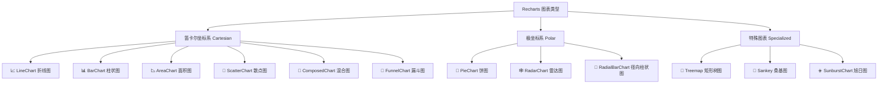

# 📊 图表类型与实战（Chart Types & Practice）

> 本章目标：全面了解 Recharts 支持的每种图表类型，掌握适用场景和实际用法

---

## 📋 图表类型总览

Recharts 支持 **12 种**图表类型，分为三大类：



---

## 📈 折线图（LineChart）

### 适用场景
- 展示数据随时间/类别的变化**趋势**
- 多组数据的趋势对比

### 基础用法

```tsx
import { LineChart, Line, XAxis, YAxis, CartesianGrid, Tooltip, Legend } from 'recharts';

const data = [
  { month: '1月', uv: 4000, pv: 2400 },
  { month: '2月', uv: 3000, pv: 1398 },
  { month: '3月', uv: 2000, pv: 9800 },
  { month: '4月', uv: 2780, pv: 3908 },
  { month: '5月', uv: 1890, pv: 4800 },
  { month: '6月', uv: 2390, pv: 3800 },
];

<LineChart width={730} height={300} data={data}>
  <CartesianGrid strokeDasharray="3 3" />
  <XAxis dataKey="month" />
  <YAxis />
  <Tooltip />
  <Legend />
  <Line type="monotone" dataKey="uv" stroke="#8884d8" activeDot={{ r: 8 }} />
  <Line type="monotone" dataKey="pv" stroke="#82ca9d" />
</LineChart>
```

### 曲线类型（Line Type）

`type` Prop 控制线条的插值方式：

| 类型 | 效果 | 适用场景 |
|------|------|---------|
| `linear` | 直线连接 | 精确数据展示 |
| `monotone` | 平滑曲线（保持单调性） | 趋势展示（最常用） |
| `natural` | 自然样条曲线 | 平滑但可能超出数据范围 |
| `step` | 阶梯线 | 离散变化（如价格档位） |
| `stepBefore` | 前阶梯 | 在变化前展示值 |
| `stepAfter` | 后阶梯 | 在变化后展示值 |
| `basis` | B 样条 | 高度平滑的曲线 |

### 进阶：虚线折线

```tsx
<Line
  type="monotone"
  dataKey="uv"
  stroke="#8884d8"
  strokeDasharray="5 5"   // 虚线模式
/>
```

---

## 📊 柱状图（BarChart）

### 适用场景
- **比较**不同类别的数值大小
- 展示排名、分布

### 基础用法

```tsx
import { BarChart, Bar, XAxis, YAxis, CartesianGrid, Tooltip, Legend } from 'recharts';

<BarChart width={730} height={300} data={data}>
  <CartesianGrid strokeDasharray="3 3" />
  <XAxis dataKey="month" />
  <YAxis />
  <Tooltip />
  <Legend />
  <Bar dataKey="uv" fill="#8884d8" />
  <Bar dataKey="pv" fill="#82ca9d" />
</BarChart>
```

### 堆叠柱状图（Stacked Bar）

```tsx
<BarChart width={730} height={300} data={data}>
  <XAxis dataKey="month" />
  <YAxis />
  <Tooltip />
  <Legend />
  <Bar dataKey="uv" stackId="a" fill="#8884d8" />
  <Bar dataKey="pv" stackId="a" fill="#82ca9d" />
</BarChart>
```

> 💡 **关键**：相同的 `stackId` 让多个 Bar 堆叠在一起。

### 圆角柱状图

```tsx
<Bar dataKey="uv" fill="#8884d8" radius={[5, 5, 0, 0]} />
```

`radius` 数组对应 `[左上, 右上, 右下, 左下]` 四个圆角。

### 水平柱状图

```tsx
<BarChart width={730} height={300} data={data} layout="vertical">
  <XAxis type="number" />
  <YAxis type="category" dataKey="month" />
  <Bar dataKey="uv" fill="#8884d8" />
</BarChart>
```

---

## 📉 面积图（AreaChart）

### 适用场景
- 展示**累积量**或**比例变化**
- 强调数据的体积感

### 基础用法

```tsx
import { AreaChart, Area, XAxis, YAxis, CartesianGrid, Tooltip } from 'recharts';

<AreaChart width={730} height={300} data={data}>
  <CartesianGrid strokeDasharray="3 3" />
  <XAxis dataKey="month" />
  <YAxis />
  <Tooltip />
  <Area type="monotone" dataKey="uv" stroke="#8884d8" fill="#8884d8" fillOpacity={0.3} />
</AreaChart>
```

### 堆叠面积图

```tsx
<AreaChart width={730} height={300} data={data}>
  <XAxis dataKey="month" />
  <YAxis />
  <Tooltip />
  <Area type="monotone" dataKey="uv" stackId="1" stroke="#8884d8" fill="#8884d8" />
  <Area type="monotone" dataKey="pv" stackId="1" stroke="#82ca9d" fill="#82ca9d" />
</AreaChart>
```

### 渐变填充

```tsx
<defs>
  <linearGradient id="colorUv" x1="0" y1="0" x2="0" y2="1">
    <stop offset="5%" stopColor="#8884d8" stopOpacity={0.8} />
    <stop offset="95%" stopColor="#8884d8" stopOpacity={0} />
  </linearGradient>
</defs>
<Area type="monotone" dataKey="uv" stroke="#8884d8" fill="url(#colorUv)" />
```

---

## 🥧 饼图（PieChart）

### 适用场景
- 展示**占比关系**
- 部分与整体的比较

### 基础用法

```tsx
import { PieChart, Pie, Cell, Tooltip, Legend } from 'recharts';

const data = [
  { name: '直接访问', value: 400 },
  { name: '搜索引擎', value: 300 },
  { name: '邮件营销', value: 200 },
  { name: '社交媒体', value: 100 },
];

const COLORS = ['#0088FE', '#00C49F', '#FFBB28', '#FF8042'];

<PieChart width={400} height={400}>
  <Pie
    data={data}
    cx="50%"
    cy="50%"
    outerRadius={120}
    dataKey="value"
    label
  >
    {data.map((entry, index) => (
      <Cell key={`cell-${index}`} fill={COLORS[index % COLORS.length]} />
    ))}
  </Pie>
  <Tooltip />
  <Legend />
</PieChart>
```

### 环形图（Donut Chart）

```tsx
<Pie
  data={data}
  cx="50%"
  cy="50%"
  innerRadius={60}     // 内圆半径
  outerRadius={120}    // 外圆半径
  dataKey="value"
/>
```

### 双层饼图

```tsx
<PieChart width={400} height={400}>
  {/* 内圈 */}
  <Pie data={innerData} dataKey="value" cx="50%" cy="50%"
       outerRadius={60} fill="#8884d8" />
  {/* 外圈 */}
  <Pie data={outerData} dataKey="value" cx="50%" cy="50%"
       innerRadius={70} outerRadius={120} fill="#82ca9d" label />
</PieChart>
```

---

## 🔘 散点图（ScatterChart）

### 适用场景
- 展示两个变量之间的**相关性**
- 发现数据分布和异常值

### 基础用法

```tsx
import { ScatterChart, Scatter, XAxis, YAxis, CartesianGrid, Tooltip } from 'recharts';

const data = [
  { x: 100, y: 200, z: 200 },
  { x: 120, y: 100, z: 260 },
  { x: 170, y: 300, z: 400 },
  { x: 140, y: 250, z: 280 },
  { x: 150, y: 400, z: 500 },
];

<ScatterChart width={600} height={400}>
  <CartesianGrid />
  <XAxis type="number" dataKey="x" name="身高" unit="cm" />
  <YAxis type="number" dataKey="y" name="体重" unit="kg" />
  <Tooltip cursor={{ strokeDasharray: '3 3' }} />
  <Scatter name="学生" data={data} fill="#8884d8" />
</ScatterChart>
```

### 气泡图（带 ZAxis）

```tsx
import { ZAxis } from 'recharts';

<ScatterChart width={600} height={400}>
  <XAxis type="number" dataKey="x" />
  <YAxis type="number" dataKey="y" />
  <ZAxis type="number" dataKey="z" range={[50, 500]} />  {/* 控制气泡大小范围 */}
  <Scatter data={data} fill="#8884d8" />
</ScatterChart>
```

---

## 🕸️ 雷达图（RadarChart）

### 适用场景
- **多维度**数据对比
- 展示能力模型、评分雷达

### 基础用法

```tsx
import { RadarChart, Radar, PolarGrid, PolarAngleAxis, PolarRadiusAxis } from 'recharts';

const data = [
  { subject: '数学', A: 120, B: 110 },
  { subject: '语文', A: 98, B: 130 },
  { subject: '英语', A: 86, B: 130 },
  { subject: '物理', A: 99, B: 100 },
  { subject: '化学', A: 85, B: 90 },
  { subject: '生物', A: 65, B: 85 },
];

<RadarChart cx="50%" cy="50%" outerRadius="80%" width={500} height={500} data={data}>
  <PolarGrid />
  <PolarAngleAxis dataKey="subject" />
  <PolarRadiusAxis />
  <Radar name="学生A" dataKey="A" stroke="#8884d8" fill="#8884d8" fillOpacity={0.6} />
  <Radar name="学生B" dataKey="B" stroke="#82ca9d" fill="#82ca9d" fillOpacity={0.6} />
</RadarChart>
```

---

## 🎯 径向柱状图（RadialBarChart）

### 适用场景
- 展示**进度**或**达成率**
- 圆形仪表盘效果

### 基础用法

```tsx
import { RadialBarChart, RadialBar, Legend, Tooltip } from 'recharts';

const data = [
  { name: '18-24', uv: 31.47, fill: '#8884d8' },
  { name: '25-29', uv: 26.69, fill: '#83a6ed' },
  { name: '30-34', uv: 15.69, fill: '#8dd1e1' },
  { name: '35-39', uv: 8.22, fill: '#82ca9d' },
];

<RadialBarChart width={500} height={300} cx="50%" cy="50%"
                innerRadius="10%" outerRadius="80%" data={data}>
  <RadialBar dataKey="uv" label={{ position: 'insideStart', fill: '#fff' }} />
  <Legend />
  <Tooltip />
</RadialBarChart>
```

---

## 🔀 混合图表（ComposedChart）

### 适用场景
- 需要在**同一坐标系**中展示不同类型的数据
- 例如：柱状表示数量，折线表示趋势

### 基础用法

```tsx
import { ComposedChart, Line, Bar, Area, XAxis, YAxis, CartesianGrid, Tooltip, Legend } from 'recharts';

<ComposedChart width={730} height={300} data={data}>
  <CartesianGrid strokeDasharray="3 3" />
  <XAxis dataKey="month" />
  <YAxis />
  <Tooltip />
  <Legend />
  <Area type="monotone" dataKey="amt" fill="#8884d8" stroke="#8884d8" />
  <Bar dataKey="pv" barSize={20} fill="#413ea0" />
  <Line type="monotone" dataKey="uv" stroke="#ff7300" />
</ComposedChart>
```

> 💡 **ComposedChart** 是最灵活的图表容器，可以在其中自由混合 Line、Bar、Area 和 Scatter。

---

## 🔽 漏斗图（FunnelChart）

### 适用场景
- 展示**转化流程**（如销售漏斗）
- 各阶段的数量衰减

### 基础用法

```tsx
import { FunnelChart, Funnel, Tooltip, LabelList } from 'recharts';

const data = [
  { name: '访问', value: 5000, fill: '#8884d8' },
  { name: '注册', value: 3000, fill: '#83a6ed' },
  { name: '下单', value: 1500, fill: '#8dd1e1' },
  { name: '付款', value: 800, fill: '#82ca9d' },
  { name: '复购', value: 300, fill: '#a4de6c' },
];

<FunnelChart width={500} height={300}>
  <Tooltip />
  <Funnel dataKey="value" data={data} isAnimationActive>
    <LabelList position="right" fill="#000" stroke="none" dataKey="name" />
  </Funnel>
</FunnelChart>
```

---

## 🌳 矩形树图（Treemap）

### 适用场景
- 展示**层级结构**的占比关系
- 文件大小分析、分类占比

### 基础用法

```tsx
import { Treemap } from 'recharts';

const data = [
  { name: '技术部', children: [
    { name: '前端', size: 250 },
    { name: '后端', size: 300 },
    { name: '测试', size: 150 },
  ]},
  { name: '产品部', children: [
    { name: '产品经理', size: 120 },
    { name: '设计师', size: 80 },
  ]},
];

<Treemap
  width={600}
  height={400}
  data={data}
  dataKey="size"
  aspectRatio={4 / 3}
  stroke="#fff"
  fill="#8884d8"
/>
```

---

## 🔗 桑基图（Sankey）

### 适用场景
- 展示**流量分配**和**流向关系**
- 能源流向、用户路径分析

### 基础用法

```tsx
import { Sankey, Tooltip } from 'recharts';

const data = {
  nodes: [
    { name: '访问' },
    { name: '注册' },
    { name: '购买' },
    { name: '离开' },
  ],
  links: [
    { source: 0, target: 1, value: 300 },
    { source: 0, target: 3, value: 200 },
    { source: 1, target: 2, value: 150 },
    { source: 1, target: 3, value: 150 },
  ],
};

<Sankey width={600} height={400} data={data}>
  <Tooltip />
</Sankey>
```

---

## ☀️ 旭日图（SunburstChart）

### 适用场景
- 展示**多层级分类**的占比
- 从中心向外展示层次结构

### 基础用法

```tsx
import { SunburstChart } from 'recharts';

const data = {
  name: '总计',
  children: [
    { name: 'A', value: 100, children: [
      { name: 'A1', value: 60 },
      { name: 'A2', value: 40 },
    ]},
    { name: 'B', value: 200 },
  ],
};

<SunburstChart width={400} height={400} data={data} />
```

---

## 🗺️ 图表选型速查

| 需求 | 推荐图表 | 关键组件 |
|------|---------|---------|
| 趋势变化 | LineChart | `Line` |
| 数值对比 | BarChart | `Bar` |
| 累积/占比面积 | AreaChart | `Area` |
| 部分与整体 | PieChart | `Pie`, `Cell` |
| 变量相关性 | ScatterChart | `Scatter` |
| 多维度对比 | RadarChart | `Radar` |
| 进度/达成率 | RadialBarChart | `RadialBar` |
| 转化漏斗 | FunnelChart | `Funnel` |
| 混合展示 | ComposedChart | `Line` + `Bar` + `Area` |
| 层级占比 | Treemap | `Treemap` |
| 流量流向 | Sankey | `Sankey` |
| 多层级环形 | SunburstChart | `SunburstChart` |

---

## 📋 本章小结

| 你学到了 | 关键点 |
|----------|--------|
| 图表分类 | 笛卡尔坐标（折线/柱状/面积/散点）、极坐标（饼/雷达/径向柱状）、特殊图表 |
| 堆叠技巧 | 使用相同的 `stackId` 实现堆叠效果 |
| 混合图表 | `ComposedChart` 可以自由组合多种系列 |
| 环形图 | 设置 `innerRadius` 即可将饼图变成环形图 |
| 气泡图 | 在散点图中使用 `ZAxis` 控制点的大小 |
| 自定义颜色 | 使用 `Cell` 组件为每个数据项设置独立颜色 |

---

## ➡️ 下一章

[⚙️ 进阶：架构与状态管理 — 理解 Recharts 的内部工作原理](./04-bindingdata-charts-architecture.md)
