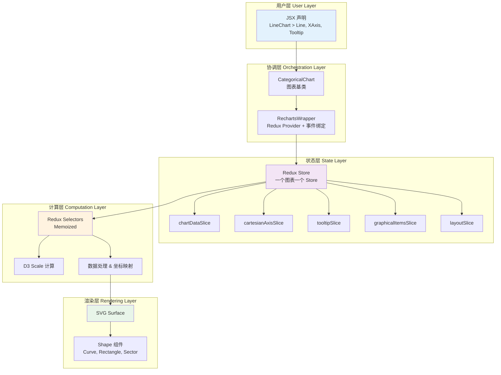
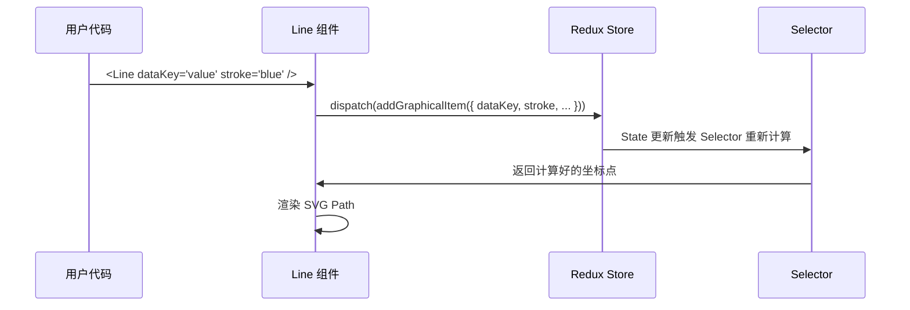
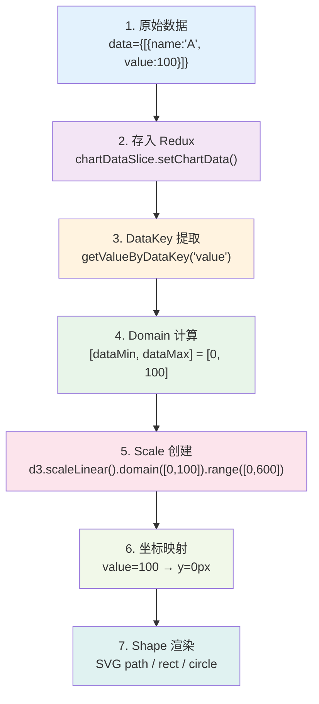
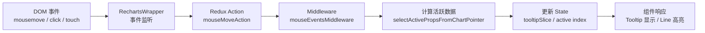
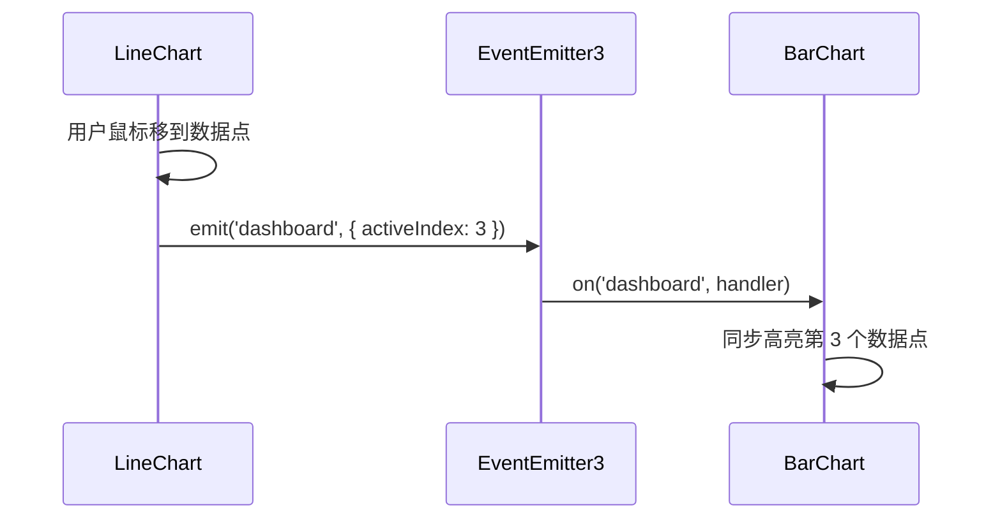

# ⚙️ 进阶：架构与状态管理（Architecture & State Management）

> 本章目标：理解 Recharts 的内部架构设计、Redux 状态管理、数据流和事件系统

---

## 🏗️ 整体架构概览

Recharts 的架构可以用一句话概括：**声明式 React 组件 + 内部 Redux 状态管理 + D3 数学计算 + SVG 渲染**。



---

## 🧱 核心架构层解析

### 1. 图表容器层（Chart Container Layer）

所有图表都有相同的容器层次：

```
用户组件（如 LineChart）
  └── CartesianChart / PolarChart    ← 坐标系类型分支
      └── CategoricalChart           ← 通用基类
          └── RechartsWrapper        ← Redux Provider + 事件绑定
              └── RootSurface        ← SVG 根元素
                  └── 子组件渲染
```

**关键文件**：

| 文件 | 职责 |
|------|------|
| `src/chart/LineChart.tsx` | 用户使用的 API 入口，极其轻薄 |
| `src/chart/CartesianChart.tsx` | 笛卡尔坐标系图表基类 |
| `src/chart/CategoricalChart.tsx` | 通用图表基类，处理子组件渲染 |
| `src/chart/RechartsWrapper.tsx` | 创建 Redux Store，绑定 DOM 事件 |
| `src/container/RootSurface.tsx` | 渲染 `<svg>` 根元素 |

**以 LineChart 为例**：

```typescript
// src/chart/LineChart.tsx - 非常简洁
export function LineChart(props) {
  return <CartesianChart {...props} />;
}
```

`LineChart` 本身几乎没有逻辑，它只是 `CartesianChart` 的一个语义化别名。真正的工作在 `CartesianChart` → `CategoricalChart` → `RechartsWrapper` 中完成。

### 2. 状态管理层（State Management Layer）

这是 Recharts v3 架构最核心的设计决策：**每个图表实例都有自己独立的 Redux Store**。

#### 为什么用 Redux？

| 设计考量 | 解释 |
|---------|------|
| **跨组件通信** | Tooltip 需要知道 Line 的数据、XAxis 的 domain——Redux 让这些共享状态有统一的管理方式 |
| **可预测性** | 复杂的交互状态（鼠标位置、激活的数据点等）需要可预测的更新流程 |
| **性能** | 通过 Selector + Reselect 的 memoization，只有真正变化的组件才重新渲染 |
| **中间件** | 鼠标/触控/键盘事件处理天然适合 Redux Middleware 模式 |

#### 为什么每个图表一个 Store？

```typescript
// src/state/store.ts
export function createRechartsStore(preloadedState?, reduxStoreName?) {
  return configureStore({
    reducer: combinedReducer,
    middleware: (getDefault) => getDefault().concat(
      mouseEventsMiddleware,
      touchEventsMiddleware,
      keyboardEventsMiddleware,
      externalEventsMiddleware,
    ),
  });
}
```

这样设计的好处：
- 页面上多个图表**互不干扰**
- 每个图表的状态**完全隔离**
- 图表卸载时 Store 自动销毁
- 图表同步（syncId）通过专门的同步机制而非共享 Store

#### Redux State 结构

```typescript
// 完整的 Store 结构
interface RechartsRootState {
  // 📊 数据相关
  chartData: {
    chartData: Array<object>;        // 原始数据
    dataStartIndex: number;          // Brush 起始索引
    dataEndIndex: number;            // Brush 结束索引
  };

  // 📐 坐标轴
  cartesianAxis: {
    xAxisMap: Record<string, AxisConfig>;
    yAxisMap: Record<string, AxisConfig>;
  };

  // 📈 数据系列
  graphicalItems: {
    lineItems: Array<LineConfig>;
    barItems: Array<BarConfig>;
    // ...
  };

  // 💬 交互
  tooltip: {
    active: boolean;
    payload: Array<TooltipPayload>;
    coordinate: { x: number, y: number };
    settings: TooltipSettings;
  };

  // 📋 图例
  legend: {
    payload: Array<LegendPayload>;
  };

  // 📐 布局
  layout: {
    width: number;
    height: number;
    margin: Margin;
  };

  // 🔍 Brush
  brush: BrushState;

  // ... 更多切片
}
```

### 3. 组件注册机制

子组件在挂载时将自己的配置"注册"到 Redux Store：



具体来说：
- **XAxis** → 向 `cartesianAxisSlice` 注册轴配置
- **Line/Bar/Area** → 向 `graphicalItemsSlice` 注册数据系列
- **Tooltip** → 从 `tooltipSlice` 读取交互状态
- **Legend** → 从 `legendSlice` 读取图例数据

---

## 🔄 数据流详解（Data Flow）

### 从数据到像素的完整旅程



### 关键步骤解析

#### Step 1-2：数据存储

```typescript
// CategoricalChart 接收 data prop 后存入 Redux
useEffect(() => {
  dispatch(setChartData(data));
}, [data, dispatch]);
```

#### Step 3：DataKey 提取

```typescript
// src/util/ChartUtils.ts
function getValueByDataKey(obj, dataKey) {
  if (typeof dataKey === 'function') return dataKey(obj);
  if (typeof dataKey === 'string') return get(obj, dataKey); // 支持嵌套路径
  return undefined;
}
```

#### Step 4-5：Domain 和 Scale

```typescript
// 自动计算 Domain
const domain = [
  Math.min(...allValues),  // dataMin
  Math.max(...allValues),  // dataMax
];

// 创建 Scale（D3 的比例尺）
const scale = d3.scaleLinear()
  .domain(domain)                    // 数据范围
  .range([chartHeight, 0]);          // 像素范围（注意 Y 轴是反转的）
```

#### Step 6-7：坐标映射和渲染

```typescript
// 把数据值转换成坐标点
const points = data.map(entry => ({
  x: xScale(getValueByDataKey(entry, xDataKey)),
  y: yScale(getValueByDataKey(entry, yDataKey)),
}));

// 用 SVG path 连接这些点
<path d={generatePath(points)} stroke={stroke} />
```

---

## 🖱️ 事件系统（Event System）

### 事件处理架构

Recharts 的事件处理采用 **中间件模式（Middleware Pattern）**：



### 事件中间件工作流程

```typescript
// src/state/mouseEventsMiddleware.ts（简化示意）
const mouseEventsMiddleware = (store) => (next) => (action) => {
  if (action.type === 'mouseMove') {
    const { chartX, chartY } = action.payload;

    // 1. 找到最近的数据点
    const activeIndex = findNearestDataPoint(chartX, chartY, store.getState());

    // 2. 构建 Tooltip 内容
    const tooltipPayload = buildTooltipPayload(activeIndex, store.getState());

    // 3. 更新状态
    store.dispatch(setTooltipActive({ active: true, payload: tooltipPayload }));
  }

  return next(action);
};
```

### 四种事件中间件

| 中间件 | 处理事件 | 职责 |
|--------|---------|------|
| `mouseEventsMiddleware` | 鼠标移动/点击 | 计算悬浮位置、激活 Tooltip |
| `touchEventsMiddleware` | 触摸事件 | 移动端的 Tooltip 交互 |
| `keyboardEventsMiddleware` | 键盘导航 | 无障碍访问支持 |
| `externalEventsMiddleware` | 外部触发 | 图表同步、程序化控制 |

---

## 🔗 图表同步机制（Chart Synchronisation）

当页面上有多个图表需要联动时（如仪表板），Recharts 提供了同步机制：

```tsx
// 两个图表使用相同的 syncId 实现同步
<LineChart syncId="dashboard" data={revenueData}>
  <Tooltip />
  <Line dataKey="revenue" />
</LineChart>

<BarChart syncId="dashboard" data={costData}>
  <Tooltip />
  <Bar dataKey="cost" />
</BarChart>
```

### 同步原理



**关键实现**：

```typescript
// src/synchronisation/useChartSynchronisation.tsx
// 使用 EventEmitter3 实现跨 Store 通信
import EventEmitter from 'eventemitter3';

const emitter = new EventEmitter();

// 发送方
emitter.emit(syncId, { activeIndex, activeCoordinate });

// 接收方
emitter.on(syncId, (data) => {
  dispatch(setActiveIndex(data.activeIndex));
});
```

> 💡 注意：虽然每个图表有独立的 Redux Store，但同步是通过 **EventEmitter** 实现跨 Store 通信的。

---

## 🎨 渲染层架构

### SVG 结构

Recharts 最终渲染为 SVG，结构如下：

```xml
<svg class="recharts-surface" width="600" height="400">
  <!-- 裁剪路径定义 -->
  <defs>
    <clipPath id="clip-xxx">
      <rect x="65" y="5" width="530" height="355" />
    </clipPath>
  </defs>

  <!-- 背景网格 -->
  <g class="recharts-cartesian-grid">
    <line x1="65" y1="360" x2="595" y2="360" />
    <!-- ... more grid lines -->
  </g>

  <!-- 数据系列（被 clip-path 裁剪） -->
  <g clip-path="url(#clip-xxx)">
    <path class="recharts-line-curve" d="M65,200 L130,150 ..." />
  </g>

  <!-- 坐标轴 -->
  <g class="recharts-xAxis">
    <line x1="65" y1="360" x2="595" y2="360" />
    <text x="130" y="380">Jan</text>
    <!-- ... more ticks -->
  </g>

  <!-- Tooltip 容器 -->
  <g class="recharts-tooltip-wrapper">
    <!-- 通过 foreignObject 或绝对定位的 HTML 渲染 -->
  </g>
</svg>
```

### Z-Index 分层

Recharts 使用显式的 Z-Index 管理来控制元素叠放顺序：

```typescript
// src/zIndex/DefaultZIndexes.ts
export const DefaultZIndexes = {
  cartesianGrid: 0,
  referenceArea: 10,
  area: 20,
  bar: 30,
  line: 40,
  scatter: 50,
  referenceLine: 60,
  referenceDot: 70,
  xAxis: 80,
  yAxis: 80,
  brush: 90,
  legend: 100,
  tooltip: 110,
};
```

---

## 🧠 Selector 模式（Redux Selectors）

Recharts 大量使用 Redux Selector 进行高效的状态派生：

```typescript
// src/state/selectors/ 目录下有大量 selector

// 示例：计算折线的渲染坐标点
export const selectLinePoints = createSelector(
  [selectChartData, selectXAxisConfig, selectYAxisConfig, selectLineConfig],
  (chartData, xAxis, yAxis, lineConfig) => {
    // 1. 根据 dataKey 提取数据
    // 2. 应用 Scale 计算坐标
    // 3. 返回可以直接渲染的点数组
    return points;
  }
);
```

Selector 的优势：
- **Memoization**：输入不变时不重新计算
- **组合性**：小 Selector 组合成大 Selector
- **测试性**：纯函数，易于单独测试

---

## 📐 布局计算

### Margin 和 Offset

```
┌─────────────────────────────────────┐
│           margin.top                │
│  ┌─────────────────────────────┐    │
│  │      offset.top             │    │
│  │  ┌───────────────────┐     │    │
│  │  │                   │     │    │
│m │o │   绘图区域         │  o  │  m │
│a │f │   (Plot Area)     │  f  │  a │
│r │f │                   │  f  │  r │
│g │s │                   │  s  │  g │
│i │e │                   │  e  │  i │
│n │t │                   │  t  │  n │
│. │. │                   │  .  │  . │
│l │l │                   │  r  │  r │
│  │e │                   │  i  │  i │
│  │f │                   │  g  │  g │
│  │t │                   │  h  │  h │
│  │  │                   │  t  │  t │
│  │  └───────────────────┘     │    │
│  │      offset.bottom          │    │
│  └─────────────────────────────┘    │
│           margin.bottom             │
└─────────────────────────────────────┘
```

- **Margin**：用户指定的外边距
- **Offset**：Recharts 自动计算的内边距（为轴标签、图例预留空间）
- **Plot Area**：实际绘制数据的区域

---

## 📋 本章小结

| 架构要点 | 关键理解 |
|---------|----------|
| **容器层次** | LineChart → CartesianChart → CategoricalChart → RechartsWrapper → RootSurface |
| **每图一 Store** | 每个图表实例有独立的 Redux Store，互不干扰 |
| **组件注册** | 子组件挂载时向 Redux Store 注册自己的配置 |
| **数据流** | data → Redux → DataKey 提取 → Scale 映射 → SVG 渲染 |
| **事件处理** | DOM 事件 → Redux Action → Middleware → State 更新 → 组件响应 |
| **图表同步** | 通过 EventEmitter 实现跨 Store 通信 |
| **Selector** | 使用 Reselect 的 memoized selector 高效派生状态 |
| **渲染输出** | 最终输出是结构化的 SVG，通过 Z-Index 管理层叠 |

---

## ➡️ 下一章

[🔍 源码解析 — 深入 Recharts 的核心代码](./05-source-code-deep-dive.md)
