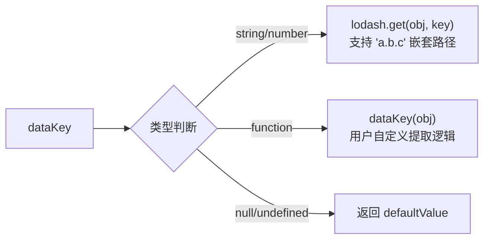
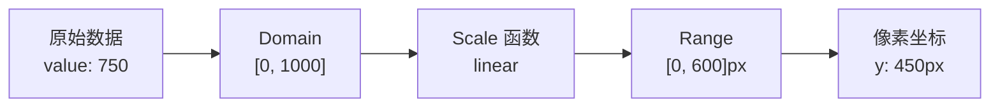
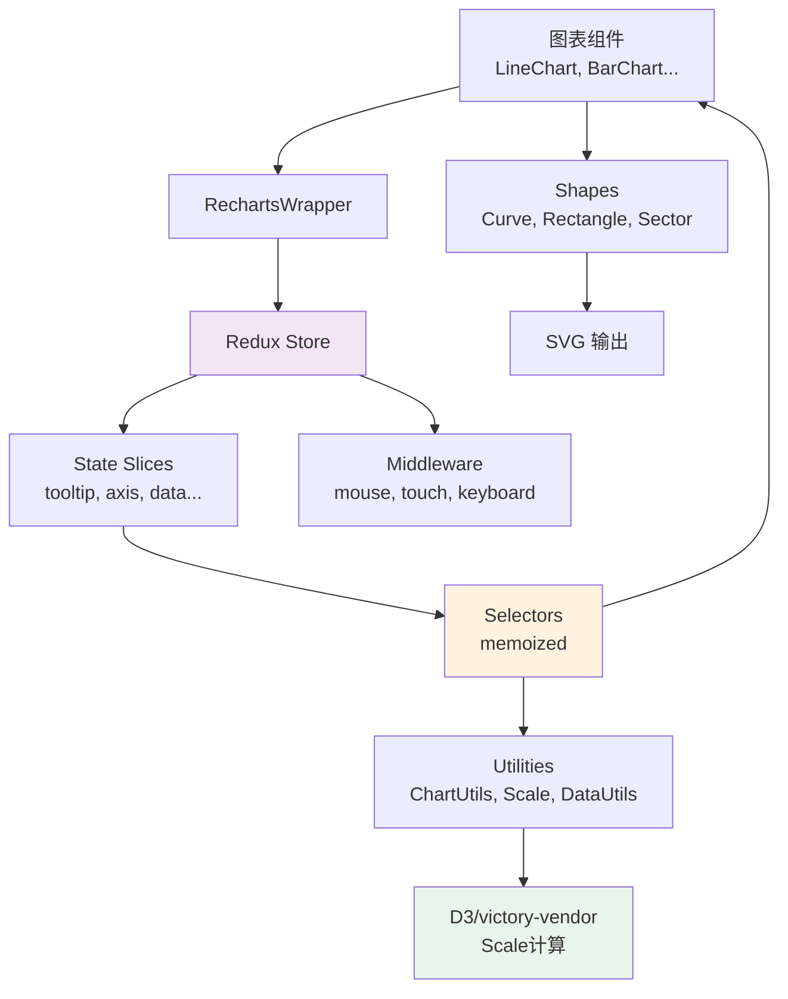

# 🔍 源码解析（Source Code Deep Dive）

> 本章目标：深入分析 Recharts 的核心源码，理解设计模式和关键实现，学习"为什么这样设计"

---

## 🎯 本章导航

| 模块 | 核心问题 |
|------|---------|
| [图表容器](#-图表容器chart-container) | 为什么 LineChart 只有几行代码？ |
| [Redux Store](#-redux-store-创建) | 每个图表一个 Store 如何实现？ |
| [DataKey 提取](#-datakey-数据提取) | 如何支持字符串、函数、嵌套路径三种形式？ |
| [Scale 系统](#️-scale-比例尺系统) | 数据如何转换成像素坐标？ |
| [事件中间件](#-事件中间件) | 鼠标交互如何映射到数据点？ |
| [动画系统](#-动画系统) | CSS 和 JS 动画如何协作？ |
| [工厂模式](#-工厂模式typed-charts) | 如何实现类型安全的图表创建？ |
| [设计模式总结](#-设计模式总结) | Recharts 使用了哪些经典模式？ |

---

## 📦 图表容器（Chart Container）

### LineChart 的源码：极致的薄层封装

```typescript
// src/chart/LineChart.tsx — 完整源码
export const LineChart = forwardRef<SVGSVGElement, CartesianChartProps<unknown>>(
  (props: CartesianChartProps<unknown>, ref) => {
    return (
      <CartesianChart
        chartName="LineChart"
        defaultTooltipEventType="axis"
        validateTooltipEventTypes={allowedTooltipTypes}
        tooltipPayloadSearcher={arrayTooltipSearcher}
        categoricalChartProps={props}
        ref={ref}
      />
    );
  },
);
```

**为什么这样设计？**

`LineChart` 本身只是 `CartesianChart` 的一个**语义化别名**。实际差异仅在于：

| 配置项 | LineChart | BarChart | ScatterChart |
|--------|-----------|----------|--------------|
| `chartName` | `"LineChart"` | `"BarChart"` | `"ScatterChart"` |
| `defaultTooltipEventType` | `"axis"` | `"axis"` | `"item"` |
| `tooltipPayloadSearcher` | `arrayTooltipSearcher` | `arrayTooltipSearcher` | `arrayTooltipSearcher` |

这种设计的好处：
1. **统一实现**：所有笛卡尔图表共享相同的渲染逻辑
2. **易于维护**：修复一个 bug 就修复了所有图表
3. **语义清晰**：用户使用 `<LineChart>` 比 `<CartesianChart type="line">` 更直观

### CategoricalChart：真正的渲染引擎

```typescript
// src/chart/CategoricalChart.tsx（简化）
export const CategoricalChart = forwardRef<SVGSVGElement, CartesianChartProps>(
  (props, ref) => {
    const { width, height, children, className, style, ...others } = props;

    return (
      <RechartsWrapper
        width={width}
        height={height}
        className={className}
        style={style}
      >
        <RootSurface ref={ref} {...svgProps}>
          <ClipPathProvider>
            {children}  {/* 用户传入的 XAxis, Line, Tooltip 等 */}
          </ClipPathProvider>
        </RootSurface>
      </RechartsWrapper>
    );
  }
);
```

**层次结构解析**：

```
CategoricalChart
  └── RechartsWrapper          ← 创建 Redux Store + 绑定 DOM 事件
      └── RootSurface          ← <svg> 根元素
          └── ClipPathProvider ← 定义裁剪路径（数据不会画出图表区域）
              └── {children}   ← 用户的组件：XAxis, Line, Tooltip 等
```

每一层都有明确的职责（**单一职责原则**），而不是把所有逻辑塞进一个巨大的组件。

---

## 🗄️ Redux Store 创建

### 核心代码

```typescript
// src/state/store.ts
export const createRechartsStore = (
  preloadedState?: Partial<RechartsRootState>,
  chartName: string = 'Chart',
): Store<RechartsRootState> => {
  return configureStore<RechartsRootState>({
    reducer: rootReducer,
    preloadedState,
    middleware: getDefaultMiddleware =>
      getDefaultMiddleware({
        serializableCheck: false,            // 允许非序列化值（如函数）
        immutableCheck: !isProduction,       // 生产环境关闭不可变性检查
      }).concat([
        mouseClickMiddleware.middleware,       // 鼠标点击
        mouseMoveMiddleware.middleware,        // 鼠标移动
        keyboardEventsMiddleware.middleware,   // 键盘导航
        externalEventsMiddleware.middleware,   // 外部事件
        touchEventMiddleware.middleware,       // 触控事件
      ]),
    enhancers: getDefaultEnhancers => {
      return getDefaultEnhancers().concat(
        autoBatchEnhancer({ type: 'raf' }),   // 使用 requestAnimationFrame 批量更新
      );
    },
    devTools: Global.devToolsEnabled && {
      name: `recharts-${chartName}`,         // Redux DevTools 中显示的名称
    },
  });
};
```

### 关键设计决策解析

#### 1. `autoBatchEnhancer({ type: 'raf' })`

```typescript
// 使用 requestAnimationFrame 进行批量更新
autoBatchEnhancer({ type: 'raf' })
```

**为什么？** 在鼠标快速移动时，会频繁触发 `mousemove` 事件。`autoBatchEnhancer` 会将同一帧内的多个 Redux 更新合并为一次渲染，避免不必要的重复渲染。

#### 2. `serializableCheck: false`

```typescript
serializableCheck: false
```

**为什么？** Recharts 的 state 中包含函数（如 `tickFormatter`、`labelFormatter`），这些不可序列化。关闭检查以避免无意义的警告。

#### 3. 每个图表独立的 Store

```typescript
// 在 RechartsStoreProvider 中
const storeRef = useRef(null);
if (storeRef.current == null) {
  storeRef.current = createRechartsStore(preloadedState, chartName);
}
```

**为什么不用全局 Store？**
- 每个图表的 XAxis 配置、数据、Tooltip 状态都不同
- 全局 Store 会导致不必要的跨图表渲染
- 图表卸载时 Store 自动销毁，无需手动清理

---

## 🔑 DataKey 数据提取

### 核心实现

```typescript
// src/util/ChartUtils.ts
export function getValueByDataKey<DataPointType, DataValueType>(
  obj: DataPointType | null | undefined,
  dataKey: DataKey<DataPointType, DataValueType> | undefined,
  defaultValue?: DataValueType,
): DataValueType | undefined {
  // Guard：空值保护
  if (isNullish(obj) || isNullish(dataKey)) {
    return defaultValue;
  }

  // Case 1：字符串或数字 → 用 lodash.get 支持嵌套路径
  if (isNumOrStr(dataKey)) {
    return get(obj, dataKey, defaultValue);
  }

  // Case 2：函数 → 直接调用
  if (typeof dataKey === 'function') {
    return dataKey(obj);
  }

  // Fallback
  return defaultValue;
}
```

### 设计分析

这个函数体现了**策略模式（Strategy Pattern）**的思想：



**为什么这样设计？**

- **字符串形式**：覆盖 90% 的简单场景（`dataKey="value"`）
- **函数形式**：覆盖复杂场景（计算值、条件提取等）
- **嵌套路径**：支持深层对象（`dataKey="metrics.revenue.total"`）

这种灵活性意味着 Recharts 不强制用户预处理数据，而是在内部适配各种数据结构。

---

## ⚖️ Scale 比例尺系统

### Scale 的本质

Scale 是一个**映射函数**，它把数据域（Domain）映射到像素范围（Range）：

```
scale(dataValue) → pixelPosition

例如：
domain = [0, 1000]    // 数据范围
range  = [0, 600]     // 像素范围

scale(500) → 300      // 数据值 500 映射到 300 像素
scale(0)   → 0
scale(1000) → 600
```

### Recharts 中的 Scale 创建

```typescript
// src/util/scale/RechartsScale.ts（概念简化）
function createScale(config) {
  const { type, domain, range } = config;

  switch (type) {
    case 'linear':
      // 线性映射：y = kx + b
      return d3.scaleLinear().domain(domain).range(range);

    case 'band':
      // 带状映射：每个分类占等宽的"带"
      return d3.scaleBand().domain(domain).range(range).padding(0.1);

    case 'log':
      // 对数映射：适合跨度大的数据
      return d3.scaleLog().domain(domain).range(range);

    case 'time':
      // 时间映射：日期到像素
      return d3.scaleTime().domain(domain).range(range);
  }
}
```

### 坐标映射流程



**注意 Y 轴的翻转**：

在 SVG 坐标系中，Y 轴是从上到下的（顶部是 0）。但在图表中，我们希望数值越大越靠上。因此 Y 轴的 Range 是反转的：

```typescript
// X 轴：正常方向
xScale.range([0, chartWidth])      // 从左到右

// Y 轴：反转方向
yScale.range([chartHeight, 0])     // 从下到上（数值越大 Y 坐标越小）
```

---

## 🖱️ 事件中间件

### 中间件架构

Recharts 将所有用户交互封装为 Redux 中间件：

```typescript
// src/state/mouseEventsMiddleware.ts（概念简化）
export const mouseMoveMiddleware = createListenerMiddleware();

mouseMoveMiddleware.startListening({
  actionCreator: mouseMoveAction,
  effect: async (action, listenerApi) => {
    const { chartX, chartY } = action.payload;
    const state = listenerApi.getState();

    // 1. 根据鼠标坐标计算活跃的数据索引
    const activeProps = selectActivePropsFromChartPointer(state, chartX, chartY);

    // 2. 更新 Tooltip 状态
    if (activeProps) {
      listenerApi.dispatch(setTooltipActive({
        active: true,
        payload: activeProps.payload,
        coordinate: activeProps.coordinate,
      }));
    }
  },
});
```

### 为什么用中间件而非组件内 state？

| 方案 | 问题 |
|------|------|
| 组件内 useState | 每个组件独立处理事件，难以协调 Tooltip + 高亮 + 图例 |
| Context | 每次鼠标移动都会导致 Context 变化，所有消费者重新渲染 |
| **Redux 中间件** | 统一的事件处理管道，通过 Selector 精确通知相关组件 |

---

## 🎬 动画系统

Recharts 的动画系统支持两种实现：

### CSS 动画

```typescript
// src/animation/CSSTransitionAnimate.tsx
// 利用 CSS transition 实现简单的过渡效果
<g style={{
  transition: `all ${duration}ms ${easing}`,
  transform: `translateX(${x}px) translateY(${y}px)`,
}}>
  {children}
</g>
```

### JavaScript 动画

```typescript
// src/animation/JavascriptAnimate.tsx（概念简化）
// 用 requestAnimationFrame 实现帧动画
function animate(from, to, duration, easing, onUpdate) {
  const startTime = performance.now();

  function frame(currentTime) {
    const elapsed = currentTime - startTime;
    const progress = Math.min(elapsed / duration, 1);
    const easedProgress = easing(progress);

    const currentValue = from + (to - from) * easedProgress;
    onUpdate(currentValue);

    if (progress < 1) {
      requestAnimationFrame(frame);
    }
  }

  requestAnimationFrame(frame);
}
```

### 缓动函数（Easing Functions）

```typescript
// src/animation/easing.ts
export const easings = {
  linear: (t) => t,
  ease: (t) => cubicBezier(0.25, 0.1, 0.25, 1.0)(t),
  'ease-in': (t) => cubicBezier(0.42, 0, 1, 1)(t),
  'ease-out': (t) => cubicBezier(0, 0, 0.58, 1)(t),
  'ease-in-out': (t) => cubicBezier(0.42, 0, 0.58, 1)(t),
};
```

### 为什么同时支持两种动画？

| 类型 | 优势 | 适用场景 |
|------|------|---------|
| CSS | 由浏览器渲染线程处理，性能好 | 简单的位移、缩放、透明度变化 |
| JavaScript | 完全控制每一帧，支持复杂路径 | SVG path 变形、复杂的序列动画 |

---

## 🏭 工厂模式（Typed Charts）

### 为什么需要工厂模式？

默认的 Recharts API 的 `dataKey` 是 `string` 类型，无法在编译时检查字段名是否存在：

```tsx
// ❌ 默认 API：dataKey 是 string，打错字段名不会有编译错误
<LineChart data={data}>
  <Line dataKey="revnue" />  {/* 拼写错误！运行时才发现 */}
</LineChart>
```

### 工厂函数的实现

```typescript
// src/util/createCartesianCharts.tsx
export function createHorizontalChart<
  TData,                    // 数据类型
  TCategorical extends string,  // 分类轴的 dataKey
  TNumerical extends string,    // 数值轴的 dataKey
>() {
  return {
    LineChart: (props: CartesianChartProps<TData>) =>
      <OriginalLineChart {...props} layout="horizontal" />,

    XAxis: (props: XAxisProps<TData, TCategorical>) =>
      <OriginalXAxis {...props} />,

    Line: (props: LineProps<TData, TNumerical>) =>
      <OriginalLine {...props} />,

    // ... 其他组件
  };
}
```

### 使用方式

```tsx
// ✅ 类型安全的 API
interface SalesData {
  month: string;
  revenue: number;
  cost: number;
}

const Charts = createHorizontalChart<SalesData, 'month', 'revenue' | 'cost'>();

<Charts.LineChart data={salesData}>
  <Charts.XAxis dataKey="month" />        {/* ✅ TypeScript 验证 'month' 存在 */}
  <Charts.Line dataKey="revenue" />       {/* ✅ TypeScript 验证 'revenue' 存在 */}
  <Charts.Line dataKey="revnue" />        {/* ❌ 编译错误！'revnue' 不在类型中 */}
</Charts.LineChart>
```

---

## 🧩 设计模式总结

### 1. 组合模式（Composite Pattern）

```
图表 = 容器 + 坐标轴 + 数据系列 + 交互组件
```

每个组件是独立的"零件"，通过 JSX 自由组合。

### 2. 策略模式（Strategy Pattern）

```
DataKey 支持多种形式：string | function | number
Scale 支持多种类型：linear | band | log | time
```

根据输入类型选择不同的处理策略。

### 3. 中间件模式（Middleware Pattern）

```
DOM 事件 → Action → Middleware（处理逻辑） → State 更新
```

事件处理逻辑与组件解耦，易于测试和维护。

### 4. 工厂模式（Factory Pattern）

```
createHorizontalChart<T>() → 类型安全的组件集合
```

通过工厂函数创建泛型化的组件。

### 5. 观察者模式（Observer Pattern）

```
Redux Store 变化 → Selector 通知 → 组件重新渲染
EventEmitter → 图表同步
```

状态变化自动通知相关消费者。

### 6. 单一职责原则（SRP）

```
LineChart     → 语义化入口
CartesianChart → 坐标系逻辑
CategoricalChart → 通用渲染
RechartsWrapper → Redux + 事件
RootSurface   → SVG 容器
```

每一层只做一件事。

### 7. 控制反转（IoC）

```
用户通过 JSX 声明 <Tooltip content={<CustomTooltip />} />
Recharts 在合适的时机渲染用户提供的组件
```

用户提供"做什么"（组件），Recharts 决定"何时做"和"如何做"。

---

## 📊 核心模块依赖关系



---

## 📋 本章小结

| 源码模块 | 核心设计思想 |
|---------|-------------|
| **图表容器** | 极薄封装 + 单一职责分层 |
| **Redux Store** | 每图一 Store + autoBatch 优化 + 5 个事件中间件 |
| **DataKey** | 策略模式支持多种数据提取方式 |
| **Scale** | D3 比例尺 + Y 轴反转映射 |
| **事件系统** | 中间件模式统一处理所有交互 |
| **动画** | CSS + JS 双引擎支持不同复杂度的动画需求 |
| **工厂模式** | 泛型工厂实现编译时类型安全 |

---

## ➡️ 下一章

[✅ 最佳实践 — 性能优化、常见问题和实战模式](./06-best-practices.md)
