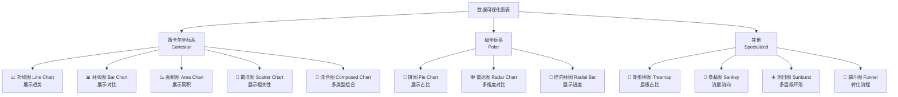
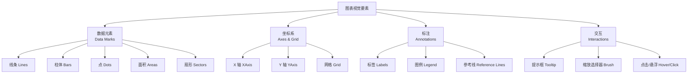

# 📊 图表世界概览（Charts Overview for Designers）

> 本章目标：理解数据可视化的基本原则、图表的分类体系，以及 Recharts 的设计语言

---

## 🌍 什么是数据可视化（Data Visualization）

数据可视化是将**数据转化为视觉形式**的过程。它的目标是：

- 让复杂的数据**一目了然**
- 帮助用户**发现趋势和异常**
- 辅助**决策和沟通**

### 类比理解

想象你有一份包含 1000 行的 Excel 表格。你能从中快速发现销售趋势吗？很难。但如果把这些数据画成一条折线，趋势就一目了然了。

**数据可视化 = 数据的翻译器**，把数字翻译成人眼容易理解的图形。

---

## 📐 Recharts 是什么

**Recharts** 是一个为 React 应用设计的图表库。对设计师来说，理解以下几点很重要：

| 特性 | 对设计的意义 |
|------|-------------|
| **SVG 渲染** | 图表是矢量图，缩放不失真，可用 CSS 控制样式 |
| **组件化** | 每个视觉元素（轴、网格、提示框）都可以独立控制 |
| **声明式** | 所见即所得——代码结构基本对应视觉结构 |
| **高度可定制** | 颜色、字体、形状、动画都可以自定义 |
| **响应式** | 支持容器自适应，适配不同屏幕尺寸 |

---

## 🗂️ 图表分类体系

### 按坐标系分类



### 按数据关系分类

| 数据关系 | 推荐图表 | Recharts 组件 |
|---------|---------|--------------|
| **趋势变化** | 折线图、面积图 | `LineChart`, `AreaChart` |
| **大小比较** | 柱状图 | `BarChart` |
| **比例/占比** | 饼图、环形图 | `PieChart` |
| **分布/相关** | 散点图 | `ScatterChart` |
| **多维对比** | 雷达图 | `RadarChart` |
| **流程转化** | 漏斗图 | `FunnelChart` |
| **流量流向** | 桑基图 | `Sankey` |
| **层级结构** | 矩形树图、旭日图 | `Treemap`, `SunburstChart` |
| **进度/达成** | 径向柱状图 | `RadialBarChart` |

---

## 🎨 图表的视觉要素

每个图表都由以下视觉要素组成：



### 在 Recharts 中的对应关系

| 视觉要素 | Recharts 组件 | 设计师需关注 |
|---------|--------------|-------------|
| 数据线条 | `<Line>` | 颜色、粗细、曲线类型 |
| 数据柱体 | `<Bar>` | 颜色、圆角、间距 |
| 数据点 | `<Dot>` / `dot` prop | 大小、形状、颜色 |
| 数据面积 | `<Area>` | 填充色、透明度、渐变 |
| 饼图扇形 | `<Pie>` + `<Cell>` | 颜色方案、内外径 |
| X/Y 坐标轴 | `<XAxis>` / `<YAxis>` | 标签格式、间距、旋转 |
| 网格 | `<CartesianGrid>` | 虚实线、颜色、密度 |
| 标签 | `<Label>` / `<LabelList>` | 位置、字体、格式 |
| 图例 | `<Legend>` | 位置、样式、图标 |
| 提示框 | `<Tooltip>` | 内容模板、样式、位置 |
| 参考线 | `<ReferenceLine>` | 颜色、标签、虚实 |
| 缩放器 | `<Brush>` | 位置、颜色、高度 |

---

## 📏 图表设计的基本原则

### 1. 数据墨水比（Data-Ink Ratio）

> "尽可能多的墨水应该用来展示数据，而不是装饰。" — Edward Tufte

```
✅ 好的设计：数据元素突出，装饰极简
❌ 坏的设计：过多的网格线、阴影、3D 效果分散注意力
```

在 Recharts 中的实践：

```tsx
// ✅ 简洁：淡色虚线网格
<CartesianGrid strokeDasharray="3 3" stroke="#f0f0f0" />

// ✅ 简洁：隐藏坐标轴线，只保留刻度
<XAxis dataKey="name" axisLine={false} tickLine={false} />
```

### 2. 颜色使用原则

| 原则 | 说明 |
|------|------|
| **区分度** | 相邻颜色要有足够的视觉差异 |
| **一致性** | 同一指标在不同图表中使用相同颜色 |
| **无障碍** | 考虑色盲用户，避免仅靠红绿区分 |
| **语义化** | 绿色=正面，红色=负面（遵循文化习惯） |
| **克制** | 一张图表建议不超过 5-7 种颜色 |

### 3. 文字排版

| 元素 | 建议 |
|------|------|
| 标题 | 16-18px，加粗 |
| 坐标轴标签 | 12-14px，常规 |
| 数据标签 | 10-12px，紧贴数据点 |
| 图例 | 12-14px，与数据颜色匹配 |
| Tooltip | 13-14px，关键数值加粗 |

### 4. 留白与间距

```
┌───────────────────────────────────┐
│         顶部留白 (margin.top)      │
│  ┌─────────────────────────────┐  │
│  │                             │  │
│  │        图表绘制区域          │  │
│  │                             │  │
│  └─────────────────────────────┘  │
│         图例区域 (Legend)          │
│         底部留白 (margin.bottom)   │
└───────────────────────────────────┘
```

**建议的 Margin 值**：
- 顶部：5-20px
- 右侧：20-40px（为 Y 轴标签留空间）
- 底部：20-40px（为 X 轴标签留空间）
- 左侧：20-40px

---

## 🖼️ Recharts 的设计语言

### SVG 渲染的优势

Recharts 使用 SVG 渲染，这对设计有几个重要影响：

| 特性 | 设计意义 |
|------|---------|
| **矢量** | 在任何分辨率下都清晰（Retina 友好） |
| **CSS 可控** | 可以用 CSS 控制颜色、字体、大小 |
| **DOM 结构** | 每个元素都是 DOM 节点，可以被开发者精确控制 |
| **动画** | 支持 CSS 和 JS 动画 |

### 默认视觉风格

Recharts 的默认样式是**简洁现代风**：

- 浅灰色虚线网格
- 无边框坐标轴
- 柔和的默认颜色
- 白色背景 Tooltip + 轻阴影
- 底部居中图例

---

## 📋 本章小结

| 你学到了 | 关键理解 |
|----------|----------|
| **数据可视化** | 把数据翻译成视觉语言的过程 |
| **图表分类** | 按坐标系（笛卡尔 / 极坐标 / 特殊）、按数据关系分类 |
| **视觉要素** | 数据元素 + 坐标系 + 标注 + 交互 |
| **设计原则** | 数据墨水比、颜色区分度、文字排版、留白 |
| **Recharts 特点** | SVG 渲染、组件化、高可定制 |

---

## ➡️ 下一章

[🎯 图表选型指南 — 如何为数据选择合适的图表](./02-chart-selection-guide.md)
