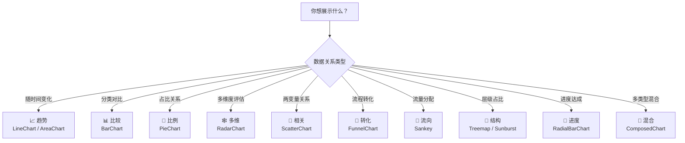
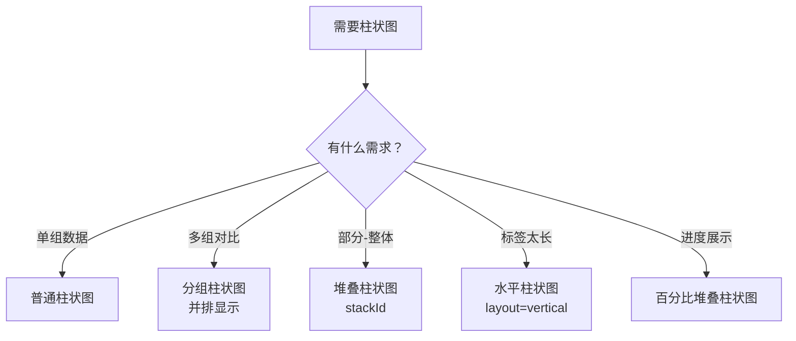

# 🎯 图表选型指南（Chart Selection Guide）

> 本章目标：学会根据数据类型和展示目标，为每个场景选择最合适的图表类型

---

## 🧭 选型决策流程

面对一个数据可视化需求时，按照以下步骤思考：



---

## 📈 展示趋势变化

### 场景
- 销售额随时间的变化
- 网站流量的日/周/月趋势
- 温度随季节的变化

### 推荐：折线图（LineChart）

```
适用条件：
✅ 时间序列数据
✅ 数据点较多（>5个）
✅ 重点是"变化趋势"而非"绝对值"
```

**设计要点**：

| 要素 | 建议 |
|------|------|
| 线条粗细 | 1.5-3px，不宜太细（看不清）也不宜太粗（遮挡） |
| 曲线类型 | `monotone` 更柔和，`linear` 更精确 |
| 数据点 | 数据少时显示，数据多时隐藏 |
| 多条线 | 建议不超过 5 条，用颜色和图例区分 |

### 何时改用面积图（AreaChart）？

```
使用面积图当：
✅ 想强调"数据的体积感"
✅ 展示累积值（如总销售额）
✅ 使用堆叠面积展示各部分的份额

不使用面积图当：
❌ 多组数据线相互交叉严重（会遮挡）
```

---

## 📊 展示数值对比

### 场景
- 各产品销售额对比
- 各地区用户数量
- 团队绩效排名

### 推荐：柱状图（BarChart）

```
适用条件：
✅ 分类数据（产品、地区、部门等）
✅ 重点是"数值大小对比"
✅ 分类数量 3-15 个
```

**设计变体决策**：



**设计要点**：

| 要素 | 建议 |
|------|------|
| 柱子间距 | 柱宽 : 间距 ≈ 2:1 |
| 颜色 | 同组用相近色调，不同组用对比色 |
| 排序 | 考虑从大到小排序（除非有自然顺序如月份） |
| 圆角 | 适度圆角（`radius={[4, 4, 0, 0]}`）更现代 |

---

## 🥧 展示占比关系

### 场景
- 各渠道的流量占比
- 部门预算分配
- 用户画像分布

### 推荐：饼图 / 环形图（PieChart）

```
适用条件：
✅ 展示部分与整体的关系
✅ 分类数量 2-7 个
✅ 数据总和有意义（=100%）

不适用条件：
❌ 分类超过 7 个（太多扇形难以区分）
❌ 不同类别的值接近（难以视觉区分）
❌ 需要精确读数（饼图的角度不如长度直观）
```

**设计决策**：

| 场景 | 选择 |
|------|------|
| 简单占比 | 饼图 |
| 中心展示总数 | 环形图（设置 innerRadius） |
| 多层级 | 双层饼图或旭日图 |
| 类别多 | 改用柱状图或矩形树图 |

**设计要点**：

| 要素 | 建议 |
|------|------|
| 颜色 | 每个扇形使用 Cell 指定独立颜色 |
| 标签 | 显示百分比和名称 |
| 最小扇形 | 占比 < 5% 的合并为"其他" |
| 起始角度 | 从 12 点方向开始（`startAngle={90}`） |

---

## 🕸️ 多维度对比

### 场景
- 产品能力评估（性能、易用性、安全性等）
- 学生各科成绩对比
- 竞品分析

### 推荐：雷达图（RadarChart）

```
适用条件：
✅ 3-8 个维度
✅ 维度之间量级相近
✅ 需要直观对比两个或多个对象

不适用条件：
❌ 维度过多（>10个）
❌ 维度量级差异大（如 0-100 vs 0-10000）
```

**设计要点**：

| 要素 | 建议 |
|------|------|
| 填充 | 半透明填充（`fillOpacity={0.3-0.6}`） |
| 对比数 | 最多 3 组数据重叠对比 |
| 网格 | 使用 `PolarGrid` 增加可读性 |
| 标签 | 维度名称清晰可读，避免重叠 |

---

## 🔘 展示变量相关性

### 场景
- 广告投入与销售额的关系
- 身高与体重的分布
- 价格与销量的关系

### 推荐：散点图（ScatterChart）

```
适用条件：
✅ 两个连续变量
✅ 数据点较多（>20个）
✅ 想发现相关性或离群值

增强：
🔘 使用气泡大小（ZAxis）展示第三个维度
🎨 使用颜色区分类别
```

---

## 🔽 展示流程转化

### 场景
- 销售漏斗（访问→注册→付费）
- 用户路径分析
- 项目管理流程

### 推荐：漏斗图（FunnelChart）

```
适用条件：
✅ 有明确的阶段顺序
✅ 每个阶段有数量数据
✅ 想展示转化率

设计要点：
📏 最宽处代表数据量最大的阶段
🎨 从深到浅的颜色渐变增强流程感
📊 标注每个阶段的转化率
```

---

## 🔀 多类型混合展示

### 场景
- 柱状表示销量 + 折线表示趋势
- 面积表示总量 + 折线表示增长率
- 不同量级的数据在同一图表中展示

### 推荐：混合图表（ComposedChart）

```
使用场景：
✅ 需要在同一坐标系中展示不同类型的数据
✅ 两组数据的量级不同（使用双Y轴）

设计要点：
📐 量级不同时使用左右两个Y轴
🎨 不同类型的数据系列使用不同的视觉形式（柱 + 线）
📋 图例说明清晰
```

---

## 📋 选型速查表

### 按数据场景快速选择

| 你要展示的 | 首选 | 备选 |
|-----------|------|------|
| 随时间的变化趋势 | 📈 LineChart | AreaChart |
| 不同类别的大小比较 | 📊 BarChart | — |
| 部分占整体的比例 | 🥧 PieChart | Treemap |
| 多维度能力对比 | 🕸️ RadarChart | — |
| 两个变量的相关性 | 🔘 ScatterChart | — |
| 转化漏斗 / 流程 | 🔽 FunnelChart | — |
| 流量分配和流向 | 🔗 Sankey | — |
| 层级数据的占比 | 🌳 Treemap | SunburstChart |
| 进度或达成率 | 🎯 RadialBarChart | — |
| 两种以上数据类型 | 🔀 ComposedChart | — |

### 按数据量推荐

| 数据量 | 推荐图表 | 注意事项 |
|--------|---------|---------|
| 2-5 个点 | 柱状图 | 折线图在数据少时不够直观 |
| 5-30 个点 | 折线图 / 面积图 | 可以显示数据点标记 |
| 30-100 个点 | 折线图 | 隐藏数据点，只显示趋势 |
| 100+ 个点 | 折线图 + Brush | 使用 Brush 选择查看范围 |

---

## 💡 常见误区

### ❌ 误区 1：所有数据都用饼图

饼图适合展示"占比"，但很多场景柱状图更有效：

- 饼图**难以精确比较**相近的数值
- 超过 7 个分类的饼图**难以阅读**
- 如果不需要强调"部分与整体"，柱状图更直观

### ❌ 误区 2：3D 效果更专业

3D 图表通常**降低可读性**：

- 3D 饼图会因透视关系**扭曲比例**
- 3D 柱状图的遮挡让**后排数据难以读取**
- Recharts 使用 2D SVG 渲染，这是现代数据可视化的主流做法

### ❌ 误区 3：颜色越多越好

- 过多颜色会造成**视觉混乱**
- 建议一张图表不超过 **5-7 种颜色**
- 使用**色调渐变**而非完全不同的颜色来区分同类数据

---

## 📋 本章小结

| 你学到了 | 关键理解 |
|----------|----------|
| **选型流程** | 先确定数据关系类型，再选择图表类型 |
| **各类型适用场景** | 每种图表都有明确的最佳使用场景 |
| **设计要点** | 每种图表的颜色、间距、标签等关键设计考量 |
| **常见误区** | 避免饼图滥用、3D 效果、过多颜色 |

---

## ➡️ 下一章

[🎨 视觉定制与交互设计 — 打造精美的图表体验](./03-bindingdata-charts-customization.md)
