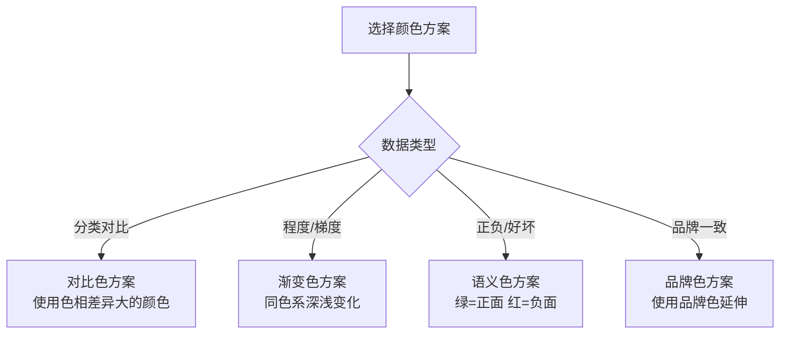

# 🎨 视觉定制与交互设计（Visual Customization & Interaction Design）

> 本章目标：掌握 Recharts 的视觉定制能力，学会设计精美的图表交互体验

---

## 🎨 颜色系统（Color System）

### 颜色方案设计

为图表选择合适的颜色方案是最重要的视觉设计决策之一。

#### 推荐的配色策略



#### 实用配色方案

**方案 1：现代柔和（推荐）**

```
#8884d8  紫色  ████
#82ca9d  绿色  ████
#ffc658  黄色  ████
#ff7300  橙色  ████
#0088FE  蓝色  ████
```

**方案 2：商务稳重**

```
#2563EB  蓝色  ████
#059669  绿色  ████
#D97706  橙色  ████
#DC2626  红色  ████
#7C3AED  紫色  ████
```

**方案 3：渐变（同系列数据）**

```
#1e3a5f  深蓝  ████
#2d5f8a  中蓝  ████
#4a90d9  亮蓝  ████
#7bb3f0  浅蓝  ████
#b3d4fc  极浅蓝 ████
```

### 在 Recharts 中使用颜色

```tsx
{/* 1. 直接设置颜色 */}
<Line stroke="#8884d8" />         {/* 线条颜色 */}
<Bar fill="#82ca9d" />            {/* 填充颜色 */}
<Area fill="#ffc658" stroke="#ffc658" fillOpacity={0.3} />  {/* 面积 + 透明度 */}

{/* 2. 每个数据点独立颜色 */}
<Pie data={data} dataKey="value">
  {data.map((entry, index) => (
    <Cell key={index} fill={COLORS[index % COLORS.length]} />
  ))}
</Pie>

// 3. 渐变填充
<defs>
  <linearGradient id="gradient" x1="0" y1="0" x2="0" y2="1">
    <stop offset="5%" stopColor="#8884d8" stopOpacity={0.8} />
    <stop offset="95%" stopColor="#8884d8" stopOpacity={0.05} />
  </linearGradient>
</defs>
<Area fill="url(#gradient)" />
```

### 无障碍颜色设计

```
设计检查清单：
☐ 色盲用户能否区分不同数据系列？
☐ 是否仅依赖颜色来传递信息？（应同时使用标签/图案）
☐ 前景色和背景色的对比度是否足够？（至少 4.5:1）
☐ 打印成黑白后是否仍可辨识？
```

---

## 📝 标签与文字（Labels & Text）

### 坐标轴标签

```tsx
// 自定义 X 轴标签样式
<XAxis
  dataKey="name"
  tick={{ fontSize: 12, fill: '#666' }}       // 字体大小和颜色
  angle={-45}                                 // 旋转角度（长标签时使用）
  textAnchor="end"                            // 旋转后的对齐方式
  height={60}                                 // 为旋转标签预留高度
/>

// 自定义 Y 轴标签
<YAxis
  tick={{ fontSize: 12, fill: '#666' }}
  tickFormatter={(value) => `¥${value.toLocaleString()}`}  // 格式化：加货币符号
  width={80}                                               // 为长标签预留宽度
/>
```

### 数据标签

```tsx
// 在数据点上显示数值
<Bar dataKey="value">
  <LabelList
    dataKey="value"
    position="top"                    // 标签位置：top, center, bottom
    formatter={(v) => v.toFixed(0)}   // 格式化数值
    style={{ fontSize: 11, fill: '#333' }}
  />
</Bar>

// 饼图标签
<Pie dataKey="value" label={({ name, percent }) =>
  `${name}: ${(percent * 100).toFixed(0)}%`
} />
```

---

## 💬 提示框设计（Tooltip Design）

Tooltip 是图表中最重要的交互元素。好的 Tooltip 设计应该：

| 原则 | 说明 |
|------|------|
| **及时** | 鼠标靠近数据点时立即出现 |
| **清晰** | 内容结构清楚，数值突出 |
| **不遮挡** | 不遮挡正在查看的数据 |
| **一致** | 与整体设计风格一致 |

### 自定义 Tooltip 示例

```tsx
// 设计师可以与开发者沟通实现这样的 Tooltip：
const DesignedTooltip = ({ active, payload, label }) => {
  if (!active || !payload?.length) return null;

  return (
    <div style={{
      background: '#ffffff',
      borderRadius: 8,
      padding: '12px 16px',
      boxShadow: '0 4px 12px rgba(0,0,0,0.08)',
      border: '1px solid #eee',
      minWidth: 150,
    }}>
      {/* 标题 */}
      <p style={{
        margin: '0 0 8px 0',
        fontSize: 13,
        color: '#999',
        borderBottom: '1px solid #f0f0f0',
        paddingBottom: 8,
      }}>
        {label}
      </p>

      {/* 数据行 */}
      {payload.map((entry, index) => (
        <div key={index} style={{
          display: 'flex',
          justifyContent: 'space-between',
          alignItems: 'center',
          marginBottom: 4,
        }}>
          <div style={{ display: 'flex', alignItems: 'center', gap: 6 }}>
            <span style={{
              width: 10, height: 10, borderRadius: 2,
              background: entry.color, display: 'inline-block',
            }} />
            <span style={{ fontSize: 13, color: '#666' }}>{entry.name}</span>
          </div>
          <span style={{ fontSize: 14, fontWeight: 600, color: '#333' }}>
            {entry.value.toLocaleString()}
          </span>
        </div>
      ))}
    </div>
  );
};
```

### Tooltip 设计规范

```
┌─────────────────────────┐
│  📅 2024年3月            │  ← 标题（时间/类别）
│  ────────────────────── │  ← 分割线
│  ●  收入  ¥12,500       │  ← 彩色指示器 + 名称 + 数值
│  ●  成本  ¥8,200        │
│  ●  利润  ¥4,300        │
└─────────────────────────┘

设计参数：
- 背景：白色，圆角 8px
- 阴影：0 4px 12px rgba(0,0,0,0.08)
- 标题：13px，灰色 #999
- 数据名：13px，深灰 #666
- 数据值：14px，加粗，黑色 #333
- 颜色指示器：10x10px，圆角 2px
```

---

## 📋 图例设计（Legend Design）

### 默认图例自定义

```tsx
// 位置控制
<Legend
  verticalAlign="bottom"      // top | middle | bottom
  align="center"              // left | center | right
  iconType="circle"           // line | square | rect | circle | diamond
  iconSize={10}
/>
```

### 图例布局建议

| 场景 | 推荐位置 | 说明 |
|------|---------|------|
| 数据系列少（2-3） | 图表顶部右侧 | 不占用图表空间 |
| 数据系列多（4+） | 图表底部 | 横排显示 |
| 移动端 | 图表上方 | 避免与操作区域重叠 |

---

## 🔗 参考线与标注（Reference Elements）

参考线帮助用户理解数据的相对位置：

```tsx
// 目标线
<ReferenceLine
  y={3000}
  stroke="#ff4d4f"
  strokeDasharray="5 5"     // 虚线
  label={{ value: '目标值', position: 'right' }}
/>

// 区域高亮
<ReferenceArea
  x1="3月"
  x2="6月"
  fill="#f0f5ff"            // 浅蓝色背景
  fillOpacity={0.3}
  label="促销期"
/>

// 标记点
<ReferenceDot
  x="5月"
  y={4800}
  r={6}
  fill="red"
  stroke="none"
  label={{ value: '峰值', position: 'top' }}
/>
```

### 设计建议

| 元素 | 用途 | 样式建议 |
|------|------|---------|
| 参考线 | 目标值、平均值、基准线 | 虚线、弱对比色 |
| 参考区域 | 时间范围标记、异常区域 | 极浅背景色、低透明度 |
| 参考点 | 关键数据标记 | 醒目颜色、带标签 |

---

## 🎬 动画设计（Animation Design）

### 默认动画

Recharts 默认为数据元素添加入场动画：

```tsx
// 控制动画参数
<Line
  isAnimationActive={true}        // 是否启用动画
  animationDuration={1500}        // 动画持续时间（ms）
  animationEasing="ease-in-out"   // 缓动函数
  animationBegin={0}              // 延迟时间（ms）
/>
```

### 缓动函数（Easing）

| 缓动 | 效果 | 适用场景 |
|------|------|---------|
| `linear` | 匀速 | 数据加载进度 |
| `ease` | 先快后慢 | 通用（默认） |
| `ease-in` | 先慢后快 | 元素进入 |
| `ease-out` | 先快后慢 | 元素退出 |
| `ease-in-out` | 慢→快→慢 | 强调动画（推荐） |

### 动画设计原则

```
✅ DO：
- 首次加载时使用入场动画
- 动画持续时间 300-1500ms
- 使用 ease-in-out 缓动
- 数据更新时使用过渡动画

❌ DON'T：
- 动画时间过长（>2s）让用户等待
- 大量数据点时使用动画（影响性能）
- 实时更新数据时使用动画（造成延迟感）
```

---

## 📱 响应式设计

### ResponsiveContainer 的工作方式

```tsx
// 图表自动适应容器宽度
<div style={{ width: '100%', height: 400 }}>
  <ResponsiveContainer>
    <LineChart data={data}>
      <XAxis dataKey="name" />
      <YAxis />
      <Line dataKey="value" />
    </LineChart>
  </ResponsiveContainer>
</div>
```

### 不同屏幕尺寸的设计建议

| 屏幕 | 图表高度 | 注意事项 |
|------|---------|---------|
| 桌面（>1024px） | 300-500px | 可以显示完整的图例和标签 |
| 平板（768-1024px） | 250-400px | 考虑减少数据标签 |
| 手机（<768px） | 200-300px | 简化坐标轴、隐藏网格、减少刻度 |

### 移动端优化建议

```
📱 移动端设计清单：
☐ 减少 X 轴刻度数量
☐ 缩短轴标签文字
☐ 隐藏不必要的网格线
☐ 增大触控区域（Tooltip 触发区域）
☐ 考虑使用 Brush 替代缩放
☐ 图例移到图表上方
```

---

## 🎯 设计交付物清单

当你设计一个图表时，需要向开发团队提供以下信息：

### 设计规范文档

```markdown
## 图表设计规范

### 基本信息
- 图表类型：折线图 (LineChart)
- 用途：展示月度收入趋势

### 尺寸
- 宽度：容器自适应 (ResponsiveContainer)
- 高度：360px
- 边距：{ top: 10, right: 30, left: 20, bottom: 10 }

### 颜色
- 收入线：#2563EB (蓝色)
- 成本线：#DC2626 (红色)
- 网格线：#F3F4F6 (极浅灰)
- 坐标轴文字：#6B7280 (灰色)

### 交互
- Tooltip：自定义样式（见设计稿）
- Legend：底部居中
- 数据点：默认隐藏，悬浮时显示

### 动画
- 入场动画：ease-in-out, 800ms
- 数据更新：无动画
```

### 与开发者的沟通要点

| 需要沟通的 | 描述 |
|-----------|------|
| 图表类型 | 选择了哪种图表，为什么 |
| 颜色方案 | 提供完整的色值表 |
| Tooltip 样式 | 提供 Tooltip 的设计稿 |
| 坐标轴格式 | 数值的格式化方式（千分位、百分比等） |
| 响应式行为 | 在不同屏幕尺寸下的表现 |
| 动画需求 | 是否需要动画、缓动方式 |
| 交互需求 | 点击事件、筛选、联动等 |

---

## 📋 本章小结

| 你学到了 | 关键理解 |
|----------|----------|
| **颜色系统** | 四种配色策略：对比色、渐变色、语义色、品牌色 |
| **Tooltip 设计** | 及时、清晰、不遮挡、一致性 |
| **图例设计** | 位置、图标、间距的最佳实践 |
| **参考线** | 用虚线和浅色标注目标值和关键区域 |
| **动画设计** | ease-in-out 300-1500ms，大数据关闭动画 |
| **响应式** | 不同屏幕尺寸的适配策略 |
| **交付物** | 设计规范文档的完整模板 |

---

## 🎓 恭喜完成学习！

你已经完成了 UI 设计师路线的全部学习。现在你应该能够：

- ✅ 理解各种图表类型的适用场景
- ✅ 为数据选择合适的图表类型
- ✅ 设计精美的图表视觉方案
- ✅ 与开发团队高效沟通图表需求
- ✅ 避免常见的数据可视化设计误区

---

## 📖 延伸阅读

→ [扩展学习资源](../further-learning.md)
